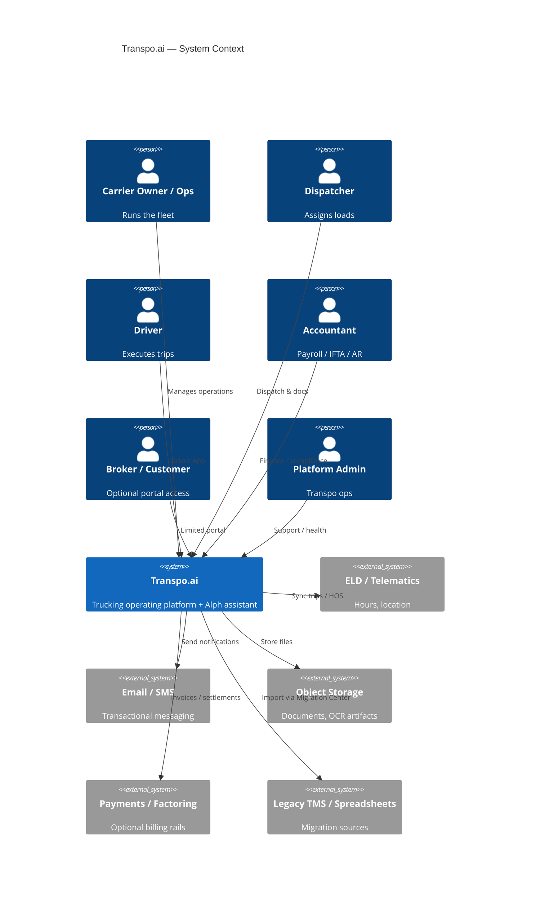
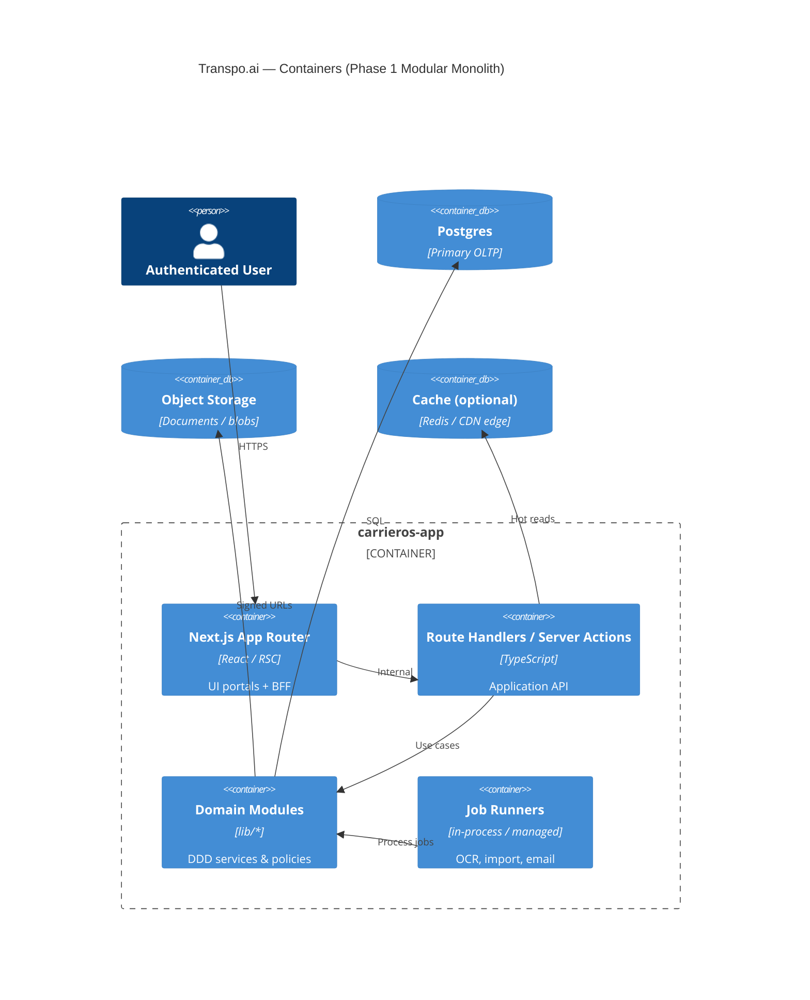
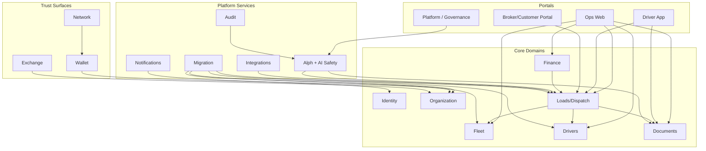

# 01 — System Overview

## Purpose

Define system context, bounded contexts, tenancy, and primary request flows for Transpo.ai. Target design evolves the current Next.js monolith.

**Governance:** [Master Constitution v1.0](../../constitution/00-master-constitution.md) — AI assists; humans decide.

---

## C4 — Context



---

## C4 — Containers (Phase 1)



**Do not overengineer:** Phase 1 is one deployable. Workers may share the same process until OCR/import volume warrants a separate worker fleet.

---

## Bounded contexts

| Context | Owns | Current `lib/` anchors |
|---------|------|------------------------|
| Identity & Access | Users, roles, sessions, permissions | `auth`, `permissions` |
| Organization | Companies, multi-entity, settings | `companies`, `settings` |
| Fleet | Trucks, trailers, maintenance | `fleet` |
| People Ops | Drivers, hiring, workforce | `drivers`, `workforce` |
| Dispatch | Loads, assignments, tracking | `dispatch`, `services/loads`, `tracking` |
| Commercial | Brokers, customers, rate cons | `brokers`, portal |
| Documents | Files, OCR, packets | `documents`, `services/documents` |
| Finance | AR/AP, payroll, fuel, IFTA | `finance`, `ifta` |
| Trust Network | Wallet, identity, reputation | `wallet`, `network` |
| Exchange | Marketplace listings/orders | `exchange` |
| Platform | App store, governance surfaces | `platform`, `constitution` helpers |
| AI Safety | Confirmations, automation, audit | `ai-safety`, `alph`, `alph-copilot` |
| Integration | ELD connectors, webhooks | `integrations`, `eld` |
| Migration | Import jobs, mapping, health | `migration` |
| Comms | Notifications, email/SMS | `notifications`, `communications` |

Cross-cutting: Audit Logs, Analytics, Billing (platform SaaS), Admin/Support.

---

## Tenancy model

**Primary key:** `company_id` (tenant) on every business row.

| Pattern | Use |
|---------|-----|
| Single-tenant company | Default carrier account |
| Multi-entity company group | Parent org + child companies (shared billing optional) |
| Platform tenant | Transpo admin / app store — separate privilege plane |
| External principals | Brokers/customers via portal memberships; drivers via driver accounts linked to company |

Rules:

- All queries **must** filter by tenant (enforced in repository layer).
- Cross-tenant data only via explicit share grants (Wallet / Network) or public tokens (e.g. track links).
- Soft isolation first; physical DB-per-tenant only if compliance contract requires it (rare).

---

## Primary request flows

### A. Interactive ops (SSR / RSC)

```
Browser → Next.js (App Router) → Server Component / Server Action
  → Application use-case (lib/services or domain)
  → Repository (tenant-scoped)
  → Postgres / object storage
  → Render or redirect
```

### B. Alph suggestion → human approval

```
User / Copilot → Alph parser/intent
  → ai-safety confidence + confirmation taxonomy
  → Draft / suggestion (never silent critical mutate)
  → Human confirm
  → Domain command + audit append
```

See [07-ai-ocr-documents.md](./07-ai-ocr-documents.md) and Master Constitution AI MAY / MUST NEVER.

### C. Document OCR

```
Upload → Object storage → Queue job
  → OCR extract → confidence score
  → Needs verification | High confidence draft
  → Human approve bind to load/driver/entity
  → Audit
```

### D. Migration import

```
Source file/API → Migration Center mapping preview
  → Human confirm mapping
  → Chunked import jobs
  → Validation report + health score
  → Commit under tenant
```

### E. External webhook / ELD sync

```
Provider → Signed webhook endpoint
  → Idempotent ingest
  → Domain update + outbox event
  → Notify interested UIs
```

---

## Module dependency (readable)



Dependency rule: **outer portals depend inward**; domains must not import UI. Alph depends on domain commands through gated adapters — never bypass AuthZ.

---

## Environments

| Env | Purpose |
|-----|---------|
| Local | Dev monolith + local Postgres/storage mocks |
| Staging | Full stack, synthetic tenants |
| Production | Multi-AZ DB, WAF, secrets manager |

Feature flags (`lib/admin/feature-flags` today) gate risky surfaces; never gate Constitution safety checks.

---

## Success criteria for the overview

- New features name their bounded context and tenant scope before coding.
- Cross-context writes go through explicit application services, not ad-hoc UI stores.
- Scale growth adds capacity (replicas, queues), not new product silos.
