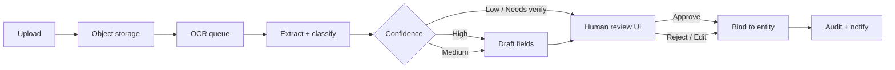

# 07 — AI, OCR & Documents

## Purpose

Architecture for Alph, document OCR, confidence/approval gates, storage, and processing queues — **constitution-first**.

**Canonical policy:** [`constitution/00-master-constitution.md`](../../constitution/00-master-constitution.md) (AI MAY / MUST NEVER, confidence levels)
**Runtime helpers:** `lib/ai-safety/`, `lib/alph/`, `lib/alph-copilot/`, `lib/documents/`, `lib/driver-app/ocr.ts`

---

## Alph services

| Component | Responsibility |
|-----------|----------------|
| Intent parser | Map natural language → structured intent (`lib/alph`) |
| Action taxonomy | Map intent → `AiActionKind` + confirmation rules |
| Executor | Run **allowed** preparations; never silent critical approve |
| Copilot roles | Dispatcher/owner/driver/… workspaces (`lib/alph-copilot`) |
| Confidence | High / Medium / Needs human verification |
| Audit | `appendAiAudit` — who suggested, who approved |

Alph **MAY**: read, OCR, extract, summarize, draft, recommend, detect gaps.
Alph **MUST NEVER**: approve payroll, payments, contracts, dispatch decisions, hiring/firing, compliance filings, taxes, insurance, safety/legal/financial decisions, or replace human judgment.

When uncertain: stop, explain, request verification — never guess or fabricate.

---

## OCR pipeline

Stages:

1. **Ingest** — virus scan, type sniff, store blob, create `documents` row
2. **Extract** — OCR + field candidates + page geometry
3. **Score** — per-field and document confidence
4. **Present** — UI shows draft + uncertainty
5. **Approve** — human binds to load/driver/truck/etc.
6. **Downstream** — packets, invoices drafts, compliance checklist updates

**Do not overengineer:** one OCR provider adapter interface; swap providers without domain rewrites.

---

## Approval gates (non-negotiable)

| Gate | Rule |
|------|------|
| Critical actions | Always human confirm (`requiresHumanConfirmation`) |
| Company automation level | May auto-apply **non-critical** only |
| Contact customers | Explicit company setting (`mayAlphContactCustomers`) |
| Migration commit | Human preview + confirm |
| Government / tax / payroll approve | Human only |

UI copy must say Draft / Suggested / Needs approval — never “Alph approved.”

---

## Document storage

| Item | Location |
|------|----------|
| Bytes | Object storage (private bucket) |
| Metadata | `documents` table |
| Extractions | `document_extractions` (JSON fields + scores) |
| Links | `document_links` (entity_type, entity_id) |
| Packets | Derived sets for load handoff |

Access via short-lived signed URLs. Drivers upload through Driver App with the same pipeline (possibly reduced field set).

Retention & legal hold: metadata flags + bucket lifecycle; finance/compliance docs follow retention policy ([15](./15-security-compliance.md)).

---

## File processing queues

Job types: `ocr.extract`, `ocr.thumbnail`, `document.packet.build`, `document.virus_scan`.

- Tenant-fair scheduling (noisy neighbor protection)
- Idempotent by `document_id` + `pipeline_version`
- Poison queue + operator visibility in admin/support tools
- Scale workers horizontally in Phase 2 — same job schema

---

## Mapping to today

| Concern | Current |
|---------|---------|
| Safety policy | `lib/ai-safety/*` |
| Alph | `lib/alph/*`, `app/alph` |
| Copilot | `lib/alph-copilot/*`, `app/alph/copilot/*` |
| Documents UI | `app/documents/*` |
| Driver OCR helper | `lib/driver-app/ocr.ts` |

Replace in-memory audit/settings with Postgres as persistence lands; **do not weaken gates** during that migration.
