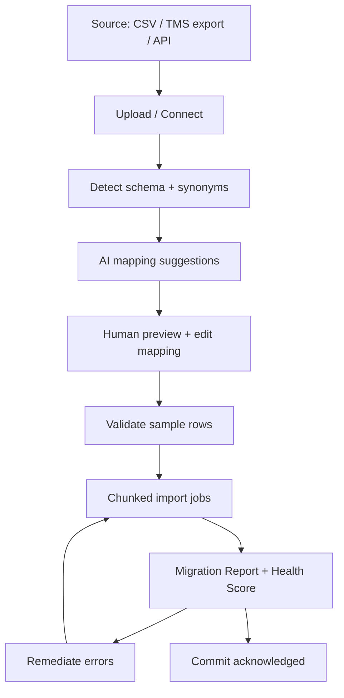

# 10 — Integrations & Migration Center

## Purpose

Connector architecture for ELD/telematics and other systems, plus the **AI Migration Center** required by the Master Constitution.

**Product surface:** `/platform/migration`
**Code anchors:** `lib/migration/*`, `lib/integrations/*`, `lib/eld/*`
**Constitution:** Migration must remain AI-assistive — humans preview, confirm, and control every import ([Master Constitution](../../constitution/00-master-constitution.md)).

---

## Integration bus (logical)

Phase 1 is not a separate message bus product — it is a **pattern**:

```
External system
  → Connector adapter (auth, pagination, webhooks)
  → Canonical ingest DTO
  → Application use-case (idempotent)
  → Domain write + outbox event
  → Notifications / search index
```

Outbound:

```
Domain event → Outbox → Connector publisher → External API
```

### Connector pattern

```typescript
// Conceptual interface — document-level, not prescribed code
interface Connector {
  id: string
  capabilities: ("pull" | "push" | "webhook")[]
  authenticate(conn: ConnectionSecrets): Promise<void>
  pull?(cursor: Cursor): AsyncIterable<CanonicalEvent>
  handleWebhook?(raw: Buffer, headers: Headers): Promise<IngestResult>
  publish?(event: OutboundEvent): Promise<void>
}
```

| Connector family | Examples |
|------------------|----------|
| ELD / telematics | HOS, location, DVIR (`lib/eld`) |
| Accounting | QBO/Xero export (later) |
| Fuel cards | Transactions → fuel module |
| Communications | Email/SMS providers |
| Factoring / payments | Invoice status |

Each connection stores: `company_id`, provider, scopes, encrypted secrets, cursor, health, last_error.

**Do not overengineer:** add connectors when customers need them; avoid a universal iPaaS rebuild.

---

## Idempotency & failure

- External IDs stored (`provider`, `external_id`) unique per tenant
- Webhook inbox raw retention for replay
- Retry with backoff; dead-letter visible in Integrations UI (`app/integrations`)
- Partial failure never corrupts unrelated tenants

---

## Migration Center architecture

Goal: customers never feel they are starting from zero.



### Components

| Piece | Responsibility |
|-------|----------------|
| Categories | Entity groups (`lib/migration/categories`) |
| Synonyms / mapping | Column → field AI assist (`synonyms`, `mapping`) |
| Cleaning | Normalize phones, states, units (`cleaning`) |
| Jobs | Chunked, resumable, tenant-fair |
| Report | Counts, errors, Health Score |
| Audit | Who confirmed mapping/commit |

### Constitution gates

- AI proposes mappings and cleans; **humans confirm** before commit
- No silent overwrite of production entities without conflict strategy UI
- Uncertainty → Needs verification rows, not guessed values presented as truth
- Migration never auto-approves payroll/compliance/tax outcomes

### Health Score (product requirement)

Composite of: mapped fields coverage, error rate, referential integrity, duplicate risk, sample verification rate. Shown in UI; not a vanity metric.

---

## Relationship to schema migrations

| Type | Owner |
|------|-------|
| DB schema migrations | Engineering deploy pipeline ([04](./04-database.md)) |
| Customer data migration | Migration Center product |

Do not conflate the two in code or docs.

---

## Scale notes

| Tier | Guidance |
|------|----------|
| T0–T1 | Sync pulls + CSV upload sufficient |
| T2 | Dedicated import workers |
| T3+ | Parallel chunk workers, provider rate-limit budgets |
| T4 | Isolate migration workers from OCR if queues contend |
