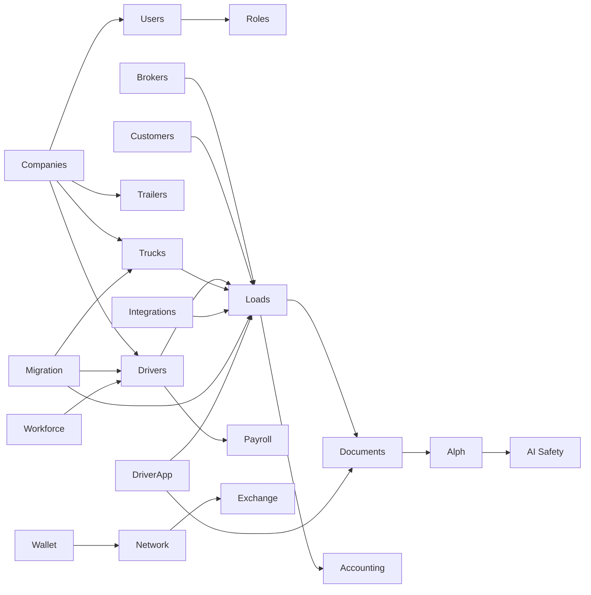

# 13 — Module Catalog

Enterprise catalog of Transpo.ai modules. Each entry includes purpose, responsibilities, tables, relationships, APIs, permissions, scalability, dependencies, performance, and security.

**Legend:** Tables/APIs are **target** contracts evolving current `lib/*` + `app/*`.
**AI rule:** All modules obey [Master Constitution v1.0](../../constitution/00-master-constitution.md) — AI drafts; humans approve critical actions.

---

## How modules are organized

| Layer | Modules |
|-------|---------|
| **Core ops** | Dashboard, Companies, Users, Roles, Drivers, Trucks, Trailers, Loads/Dispatch, Customers, Brokers, Documents/OCR, Maintenance, Fuel, Compliance |
| **Money** | Accounting, Payroll, Billing (SaaS), Wallet (trust — not always money movement) |
| **Intelligence** | Alph, Analytics, Reports, Audit Logs |
| **Platform** | Settings, Notifications, Integrations, Migration Center, Platform/App Store |
| **Surfaces** | Driver App, Exchange/Marketplace, Workforce, Network/Trust |

---

## Dashboard

| Field | Detail |
|-------|--------|
| **Purpose** | Two-second ops snapshot: what is happening, problems, next actions |
| **Responsibilities** | Aggregate KPIs; surface alerts; deep-link to modules; no durable writes |
| **Database Tables** | Read models: `dashboard_snapshots` (optional cache); reads loads/drivers/fleet/finance views |
| **Relationships** | Depends on Loads, Drivers, Fleet, Documents, Compliance, Notifications |
| **API Endpoints** | `GET /api/v1/dashboard/summary` |
| **Permissions** | `dashboard:read` (role-filtered widgets) |
| **Future Scalability** | Precomputed snapshots per company; edge cache short TTL |
| **Dependencies** | All core read models |
| **Performance** | Server-side aggregation only; never hydrate full fleets |
| **Security** | Tenant-scoped; hide widgets without permission |

*Current:* `app/dashboard`, `lib/executive`, `lib/fleet/fleet-dashboard.ts`

---

## Companies

| Field | Detail |
|-------|--------|
| **Purpose** | Tenant organization and multi-entity structure |
| **Responsibilities** | Company profile, entities, branding, legal IDs (DOT/MC), lifecycle |
| **Database Tables** | `companies`, `company_entities`, `company_settings` |
| **Relationships** | Parent of nearly all tenant data; Users memberships |
| **API Endpoints** | `GET/PATCH /api/v1/companies/current`, `GET /api/v1/companies/:id` |
| **Permissions** | `company:read`, `company:admin` |
| **Future Scalability** | Org groups; shared services across entities |
| **Dependencies** | Settings, Billing entitlements |
| **Performance** | Hot-cached company config |
| **Security** | Strict tenant root; platform admin break-glass audited |

*Current:* `app/companies`, `lib/companies`

---

## Users

| Field | Detail |
|-------|--------|
| **Purpose** | Human accounts for ops/portal/platform |
| **Responsibilities** | Identity profile, membership, invites, status |
| **Database Tables** | `users`, `memberships`, `invites`, `user_mfa_factors` |
| **Relationships** | Roles; Companies; optional Driver link |
| **API Endpoints** | `GET /api/v1/users`, `POST /api/v1/users/invite`, `PATCH /api/v1/users/:id` |
| **Permissions** | `users:read`, `users:manage` |
| **Future Scalability** | SCIM provisioning at enterprise tier |
| **Dependencies** | Auth, Roles, Notifications |
| **Performance** | Indexed email unique globally or per auth realm |
| **Security** | MFA; least privilege; no cross-tenant user listing |

---

## Roles

| Field | Detail |
|-------|--------|
| **Purpose** | RBAC definitions and assignments |
| **Responsibilities** | Role templates, custom roles, permission grants |
| **Database Tables** | `roles`, `role_permissions`, `membership_roles` |
| **Relationships** | Users, Permissions catalog |
| **API Endpoints** | `GET/PUT /api/v1/roles`, `PUT /api/v1/memberships/:id/roles` |
| **Permissions** | `roles:manage` (step-up MFA) |
| **Future Scalability** | ABAC conditions stored alongside grants |
| **Dependencies** | Permissions, Audit |
| **Performance** | Cache permission sets per session |
| **Security** | Prevent privilege escalation; audit all changes |

*Current:* `lib/permissions`, `app/settings/permissions`

---

## Drivers

| Field | Detail |
|-------|--------|
| **Purpose** | Driver master data and lifecycle |
| **Responsibilities** | Profile, license/medical, assignment readiness, safety/performance views, hiring intake |
| **Database Tables** | `drivers`, `driver_licenses`, `driver_medicals`, `driver_documents`, `driver_time_off` |
| **Relationships** | Loads assignments; Trucks; Payroll; Documents; Workforce candidates; Wallet identity |
| **API Endpoints** | `CRUD /api/v1/drivers`, `GET /api/v1/drivers/:id/timeline` |
| **Permissions** | `drivers:read`, `drivers:write`, `drivers:sensitive_read` |
| **Future Scalability** | Partition documents; search index for directories |
| **Dependencies** | Fleet, Compliance, Documents, Payroll |
| **Performance** | List indexes on status; avoid N+1 on detail |
| **Security** | PII encryption at rest; field-level AuthZ for license/medical |

*Current:* `app/drivers`, `lib/drivers`, `lib/services/drivers`

---

## Trucks

| Field | Detail |
|-------|--------|
| **Purpose** | Power unit asset register |
| **Responsibilities** | Specs, status, assignment, inspections linkage |
| **Database Tables** | `trucks`, `truck_documents` |
| **Relationships** | Trailers (pairings); Drivers; Maintenance; Fuel; Loads |
| **API Endpoints** | `CRUD /api/v1/fleet/trucks` |
| **Permissions** | `fleet:read`, `fleet:write` |
| **Future Scalability** | IoT status via integrations — not polled in UI |
| **Dependencies** | Maintenance, Compliance, Integrations |
| **Performance** | Status board query `(company_id, status)` |
| **Security** | VIN/plate sensitive operational data; tenant scoped |

*Current:* `app/fleet/trucks`, `lib/fleet`, `lib/services/fleet`

---

## Trailers

| Field | Detail |
|-------|--------|
| **Purpose** | Trailer asset register |
| **Responsibilities** | Specs, status, pairings, inspections |
| **Database Tables** | `trailers`, `trailer_documents` |
| **Relationships** | Trucks; Loads; Maintenance |
| **API Endpoints** | `CRUD /api/v1/fleet/trailers` |
| **Permissions** | `fleet:read`, `fleet:write` |
| **Future Scalability** | Same as Trucks |
| **Dependencies** | Fleet, Maintenance |
| **Performance** | Same indexing pattern as trucks |
| **Security** | Tenant scoped |

*Current:* `app/fleet/trailers`

---

## Loads / Dispatch

| Field | Detail |
|-------|--------|
| **Purpose** | Core operational load lifecycle and assignment |
| **Responsibilities** | Create/edit loads, stops, assign driver/equipment, status, tracking views, rate con prep |
| **Database Tables** | `loads`, `load_stops`, `load_assignments`, `load_status_events`, `tracking_points` |
| **Relationships** | Brokers/Customers; Drivers; Trucks/Trailers; Documents; Finance; Notifications |
| **API Endpoints** | `CRUD /api/v1/loads`, `POST .../assign`, `GET .../tracking`, public `GET /track/:token` |
| **Permissions** | `loads:read`, `loads:write`, `loads:assign`, `loads:cancel` |
| **Future Scalability** | Hot board cache; tracking archive/partitions; assign path highly optimized |
| **Dependencies** | Fleet, Drivers, Documents, Brokers, Tracking, Alph (suggestions only) |
| **Performance** | Board query by status/time; tracking writes via ingest API batched |
| **Security** | Assignment is critical — AI suggests only; AuthZ + audit; public tokens capability-based |

*Current:* `app/loads`, `lib/dispatch`, `lib/services/loads`, `lib/tracking`

**Constitution:** AI MUST NEVER approve dispatch decisions.

---

## Customers

| Field | Detail |
|-------|--------|
| **Purpose** | Shipper/consignee/customer master |
| **Responsibilities** | Contacts, locations, credit terms, load history |
| **Database Tables** | `customers`, `customer_locations`, `customer_contacts` |
| **Relationships** | Loads; Invoices; Portal users |
| **API Endpoints** | `CRUD /api/v1/customers` |
| **Permissions** | `customers:read`, `customers:write` |
| **Future Scalability** | Shared locations graph per tenant |
| **Dependencies** | Loads, Finance, Portal |
| **Performance** | Search trigram on name |
| **Security** | Commercial terms confidential |

*Note:* May start as subset of brokers/shippers data model if unified “parties” table is chosen — avoid duplicate party records.

---

## Brokers

| Field | Detail |
|-------|--------|
| **Purpose** | Broker counterparty master |
| **Responsibilities** | Profile, contacts, performance, load linkage |
| **Database Tables** | `brokers`, `broker_contacts` |
| **Relationships** | Loads; Documents; Network trust optional |
| **API Endpoints** | `CRUD /api/v1/brokers` |
| **Permissions** | `brokers:read`, `brokers:write` |
| **Future Scalability** | Reputation signals from Network (read API) |
| **Dependencies** | Loads, Documents, Finance |
| **Performance** | Directory search indexes |
| **Security** | Tenant scoped; external portal least privilege |

*Current:* `app/brokers`, `lib/brokers`

---

## Documents / OCR

| Field | Detail |
|-------|--------|
| **Purpose** | Document system of record + OCR extraction |
| **Responsibilities** | Upload, classify, extract, verify, packetize, health |
| **Database Tables** | `documents`, `document_extractions`, `document_links`, `document_packets` |
| **Relationships** | Loads, Drivers, Fleet, Finance, Compliance |
| **API Endpoints** | `POST /api/v1/documents`, `GET .../:id`, `POST .../:id/approve-extraction` |
| **Permissions** | `documents:read`, `documents:write`, `documents:approve_ocr` |
| **Future Scalability** | Worker fleets; per-tenant OCR quotas; CDN for thumbnails |
| **Dependencies** | Object storage, Alph/OCR, Notifications, AI Safety |
| **Performance** | Async pipeline; signed URL uploads direct-to-storage |
| **Security** | Private buckets; malware scan; PII; approval gates |

*Current:* `app/documents`, `lib/documents`, `lib/services/documents`
See [07-ai-ocr-documents.md](./07-ai-ocr-documents.md).

---

## Accounting

| Field | Detail |
|-------|--------|
| **Purpose** | Carrier freight accounting (AR/AP drafts and ledgers) |
| **Responsibilities** | Invoices, bills, settlements drafts, exports |
| **Database Tables** | `invoices`, `invoice_lines`, `bills`, `payments`, `ledger_entries` |
| **Relationships** | Loads, Brokers/Customers, Payroll (cost), Documents |
| **API Endpoints** | `CRUD /api/v1/finance/invoices`, `POST .../prepare`, `POST .../approve` |
| **Permissions** | `finance:read`, `finance:write`, `finance:approve` |
| **Future Scalability** | Period close locks; export jobs; integration connectors |
| **Dependencies** | Loads, Documents, Billing≠this module |
| **Performance** | Append-only ledger; report replicas later |
| **Security** | Step-up for approve/pay; AI drafts only |

*Current:* `app/finance`, `lib/finance`
**Constitution:** AI MUST NEVER approve accounting or payments.

---

## Payroll

| Field | Detail |
|-------|--------|
| **Purpose** | Driver/contractor pay calculation and approval |
| **Responsibilities** | Pay periods, settlements drafts, deductions, approvals |
| **Database Tables** | `payroll_runs`, `payroll_items`, `payroll_adjustments` |
| **Relationships** | Drivers, Loads, Accounting, Documents |
| **API Endpoints** | `POST /api/v1/payroll/runs/prepare`, `POST .../approve` |
| **Permissions** | `payroll:read`, `payroll:prepare`, `payroll:approve` |
| **Future Scalability** | Batch runs async; large fleets chunked |
| **Dependencies** | Drivers, Loads, Finance, AI Safety |
| **Performance** | Prepare as job; UI polls status |
| **Security** | MFA on approve; full audit |

*Current:* `app/payroll`, driver payroll views
**Constitution:** AI MUST NEVER approve payroll.

---

## Maintenance

| Field | Detail |
|-------|--------|
| **Purpose** | Asset maintenance and DVIR follow-up |
| **Responsibilities** | Work orders, schedules, vendor notes, downtime status |
| **Database Tables** | `maintenance_orders`, `maintenance_schedules`, `maintenance_logs` |
| **Relationships** | Trucks, Trailers, Drivers (DVIR), Compliance |
| **API Endpoints** | `CRUD /api/v1/fleet/maintenance` |
| **Permissions** | `maintenance:read`, `maintenance:write` |
| **Future Scalability** | Predictive suggestions (AI) — human schedules |
| **Dependencies** | Fleet, Documents, Notifications |
| **Performance** | Due-date indexes |
| **Security** | Tenant scoped; safety-related changes audited |

*Current:* `app/fleet/maintenance`, Alph maintenance copilot

---

## Fuel

| Field | Detail |
|-------|--------|
| **Purpose** | Fuel transactions and IFTA inputs |
| **Responsibilities** | Import fuel buys, map to trucks, tax prep support |
| **Database Tables** | `fuel_transactions`, `fuel_cards` (optional) |
| **Relationships** | Trucks, IFTA/Compliance, Accounting |
| **API Endpoints** | `GET/POST /api/v1/fuel/transactions`, import job endpoints |
| **Permissions** | `fuel:read`, `fuel:write` |
| **Future Scalability** | Card connector sync jobs |
| **Dependencies** | Fleet, IFTA, Integrations |
| **Performance** | Bulk import chunked |
| **Security** | Card numbers tokenized / never stored raw |

*Current:* partly under `lib/ifta`, finance — elevate as module boundary as data grows.

---

## Compliance

| Field | Detail |
|-------|--------|
| **Purpose** | Regulatory readiness and expirations |
| **Responsibilities** | Checklist, expirations, safety items, filing prep (not auto-file) |
| **Database Tables** | `compliance_items`, `compliance_events` |
| **Relationships** | Drivers, Fleet, Documents, IFTA |
| **API Endpoints** | `GET /api/v1/compliance/summary`, `PATCH /api/v1/compliance/items/:id` |
| **Permissions** | `compliance:read`, `compliance:write` |
| **Future Scalability** | Scheduled scanners; notification fan-out |
| **Dependencies** | Documents, Drivers, Fleet, Notifications |
| **Performance** | Expiry indexes `(company_id, expires_on)` |
| **Security** | AI MUST NEVER approve compliance/government filings |

*Current:* `app/compliance`, `lib/compliance`, `lib/ifta`

---

## Reports

| Field | Detail |
|-------|--------|
| **Purpose** | Operative and financial report generation |
| **Responsibilities** | Parameterized reports, async export, templates |
| **Database Tables** | `report_runs`, `report_defs` |
| **Relationships** | Analytics read models; domain sources |
| **API Endpoints** | `POST /api/v1/reports/runs`, `GET .../:id` |
| **Permissions** | Per-report permission keys |
| **Future Scalability** | Worker + replica; store artifacts in object storage |
| **Dependencies** | Analytics, Finance, Loads |
| **Performance** | Always async for heavy reports |
| **Security** | AuthZ on data included; watermark external shares |

---

## Alph

| Field | Detail |
|-------|--------|
| **Purpose** | AI assistant that prepares and explains — never operates the business |
| **Responsibilities** | Parse intents, draft actions, explain confidence, route confirmations |
| **Database Tables** | `ai_suggestions`, `ai_audit_entries`, `ai_company_settings` |
| **Relationships** | All domains via gated adapters; AI Safety |
| **API Endpoints** | `POST /api/v1/alph/suggest`, `POST /api/v1/alph/confirm` |
| **Permissions** | `alph:use` + underlying action permissions |
| **Future Scalability** | Model routing; per-tenant rate limits; async long drafts |
| **Dependencies** | `ai-safety`, domain services |
| **Performance** | Stream responses; cache retrieval contexts carefully (tenant isolation) |
| **Security** | Prompt injection hardening; no secret leakage; constitution gates mandatory |

*Current:* `lib/alph`, `lib/alph-copilot`, `app/alph`
See [07](./07-ai-ocr-documents.md).

---

## Notifications

| Field | Detail |
|-------|--------|
| **Purpose** | In-app and channel notifications |
| **Responsibilities** | Fan-out, preferences, read state |
| **Database Tables** | `notifications`, `notification_preferences` |
| **Relationships** | Users, domain events |
| **API Endpoints** | `GET /api/v1/notifications`, `POST .../read` |
| **Permissions** | Self-scoped; `notifications:broadcast` rare |
| **Future Scalability** | Queue workers; SSE later |
| **Dependencies** | Communications providers |
| **Performance** | Indexed unread per user |
| **Security** | No cross-tenant; suppressions honored |

*Current:* `lib/notifications`, `app/notifications` — see [08](./08-search-notifications-email.md).

---

## Settings

| Field | Detail |
|-------|--------|
| **Purpose** | Company and user configuration |
| **Responsibilities** | Sections, defaults, AI policy settings, permissions UI entry |
| **Database Tables** | `company_settings`, `user_settings` |
| **Relationships** | Companies, AI Safety, Roles |
| **API Endpoints** | `GET/PUT /api/v1/settings/:section` |
| **Permissions** | `settings:read`, `settings:admin` |
| **Future Scalability** | Schema-versioned settings JSON with validation |
| **Dependencies** | AuthZ, AI Safety |
| **Performance** | Cache per company |
| **Security** | Dangerous settings require step-up; AI contact flags explicit |

*Current:* `lib/settings`, `app/settings`

---

## Integrations

| Field | Detail |
|-------|--------|
| **Purpose** | External system connections |
| **Responsibilities** | OAuth/keys, sync health, webhook endpoints, ELD catalog |
| **Database Tables** | `integration_connections`, `webhook_inbox`, `sync_cursors` |
| **Relationships** | Loads tracking, Fuel, Documents, Migration |
| **API Endpoints** | `CRUD /api/v1/integrations/connections`, `POST /api/v1/webhooks/:provider` |
| **Permissions** | `integrations:manage` |
| **Future Scalability** | Connector workers; rate budgets |
| **Dependencies** | Outbox, Secrets manager |
| **Performance** | Async sync; inbox ack fast |
| **Security** | Encrypted secrets; signature verify; least scopes |

*Current:* `app/integrations`, `lib/integrations`, `lib/eld` — see [10](./10-integrations-migration.md).

---

## Migration Center

| Field | Detail |
|-------|--------|
| **Purpose** | Constitution-required AI-assisted customer data import |
| **Responsibilities** | Upload, map, preview, validate, import, health score, report |
| **Database Tables** | `migration_jobs`, `migration_mappings`, `migration_row_errors`, `migration_artifacts` |
| **Relationships** | Companies, Drivers, Fleet, Loads, Brokers, Customers |
| **API Endpoints** | `POST /api/v1/migrations`, `POST .../mappings/confirm`, `POST .../commit` |
| **Permissions** | `migration:run`, `migration:commit` |
| **Future Scalability** | Chunk workers; fair queues |
| **Dependencies** | AI Safety, domain repos, object storage |
| **Performance** | Streaming CSV; batched inserts |
| **Security** | Human confirm; no silent prod overwrite; audit |

*Current:* `lib/migration`, `/platform/migration` — see [10](./10-integrations-migration.md).

---

## Audit Logs

| Field | Detail |
|-------|--------|
| **Purpose** | Tamper-evident activity trail for security and AI |
| **Responsibilities** | Record actor, action, entity, before/after, approval |
| **Database Tables** | `audit_events`, `ai_audit_entries` |
| **Relationships** | All sensitive modules |
| **API Endpoints** | `GET /api/v1/audit` (filtered) |
| **Permissions** | `audit:read` |
| **Future Scalability** | Append-only; cold storage tiering |
| **Dependencies** | Auth context middleware |
| **Performance** | Write-optimized; async acceptable if durable queue |
| **Security** | Immutable; admin-only; retention policy |

*Current:* `lib/permissions/audit.ts`, `lib/ai-safety/audit.ts`

---

## Analytics

| Field | Detail |
|-------|--------|
| **Purpose** | Trends and operational intelligence |
| **Responsibilities** | Aggregations, executive boards, usage insights |
| **Database Tables** | `analytics_rollups_*` (target) |
| **Relationships** | Loads, Fleet, Finance, AI metrics |
| **API Endpoints** | `GET /api/v1/analytics/:widget` |
| **Permissions** | `analytics:read` |
| **Future Scalability** | Rollup jobs; replicas |
| **Dependencies** | OLTP read models |
| **Performance** | No heavy scans on primary at peak |
| **Security** | Aggregates only; tenant scoped |

*Current:* `app/analytics`, `lib/executive` — see [09](./09-analytics-reporting-billing.md).

---

## Billing

| Field | Detail |
|-------|--------|
| **Purpose** | Transpo.ai SaaS subscription billing |
| **Responsibilities** | Plans, entitlements, meters, invoices, dunning |
| **Database Tables** | `subscriptions`, `usage_events`, `billing_invoices` |
| **Relationships** | Companies; Feature flags |
| **API Endpoints** | `GET /api/v1/billing/subscription`, provider webhooks |
| **Permissions** | `billing:manage` (owner) |
| **Future Scalability** | Meter aggregation pipeline |
| **Dependencies** | Payment provider |
| **Performance** | Async metering |
| **Security** | PCI via provider; never store raw cards |

Distinct from Accounting (freight). See [09](./09-analytics-reporting-billing.md).

---

## Wallet / Trust / Network (Identity)

| Field | Detail |
|-------|--------|
| **Purpose** | Portable trust identity, sharing, reputation graph |
| **Responsibilities** | Passport/profile, document wallet, share grants, connections, trust signals |
| **Database Tables** | `wallet_profiles`, `wallet_documents`, `share_grants`, `network_connections`, `network_profiles` |
| **Relationships** | Users/Drivers/Companies; Exchange trust; Driver App |
| **API Endpoints** | `GET /api/v1/wallet`, `POST /api/v1/wallet/shares`, `GET /api/v1/network/p/:transpoId` |
| **Permissions** | `wallet:manage_self`, `network:connect`; public fields only externally |
| **Future Scalability** | Graph/search extract; CDN public profiles |
| **Dependencies** | Documents, Auth, Notifications |
| **Performance** | Cache public profiles |
| **Security** | Explicit grants; minimize PII on public graph; user ownership |

*Current:* `app/wallet`, `app/network`, `lib/wallet`, `lib/network`

---

## Exchange / Marketplace

| Field | Detail |
|-------|--------|
| **Purpose** | Equipment/freight/services marketplace |
| **Responsibilities** | Listings, orders, auctions, seller profiles, insights |
| **Database Tables** | `exchange_listings`, `exchange_orders`, `exchange_sellers` |
| **Relationships** | Companies; Network trust; Billing entitlements optional |
| **API Endpoints** | `CRUD /api/v1/exchange/listings`, `POST .../orders` |
| **Permissions** | `exchange:sell`, `exchange:buy`, public read for published |
| **Future Scalability** | Search index; CDN; modular extract |
| **Dependencies** | Network, Notifications, Auth |
| **Performance** | Read-heavy caching |
| **Security** | Fraud/moderation; separate from dispatch OLTP writes |

*Current:* `app/exchange`, `app/marketplace`, `lib/exchange` — see [11](./11-future-surfaces.md).

---

## Driver App

| Field | Detail |
|-------|--------|
| **Purpose** | Driver-facing execution surface |
| **Responsibilities** | Trips, docs upload, DVIR, expenses, messages, offline sync, Alph assist |
| **Database Tables** | Uses Drivers/Loads/Documents; `driver_devices`, `offline_mutation_queue` |
| **Relationships** | Loads, Documents, Wallet, Notifications, Alph |
| **API Endpoints** | `GET /api/v1/driver/trips`, `POST /api/v1/driver/documents`, sync endpoints |
| **Permissions** | Driver self-scope only |
| **Future Scalability** | Separate deployable; push notifications |
| **Dependencies** | Private API, OCR pipeline |
| **Performance** | Offline-first; small payloads |
| **Security** | Device binding; least data; constitution on Alph |

*Current:* `app/driver`, `lib/driver-app`, `lib/driver-mobile`

---

## Platform / App Store

| Field | Detail |
|-------|--------|
| **Purpose** | Ecosystem apps, partners, governance hubs |
| **Responsibilities** | App catalog, installs, scopes, developer portal, constitution pages |
| **Database Tables** | `platform_apps`, `app_installs`, `partner_profiles` |
| **Relationships** | Public API scopes; Companies |
| **API Endpoints** | `GET /api/v1/platform/apps`, `POST .../install` |
| **Permissions** | `platform:install_apps`; public read catalog |
| **Future Scalability** | Independent module |
| **Dependencies** | AuthZ scopes, Billing entitlements |
| **Performance** | CDN catalog |
| **Security** | Least-privilege OAuth; review process for apps |

*Current:* `app/platform`, `lib/platform`

---

## Workforce

| Field | Detail |
|-------|--------|
| **Purpose** | Hiring and workforce pipeline (present in codebase) |
| **Responsibilities** | Jobs, candidates, interviews, certifications, training, company workforce pages |
| **Database Tables** | `workforce_jobs`, `candidates`, `interviews`, `certifications`, `training_records` |
| **Relationships** | Drivers (hire → driver); Compliance; Documents |
| **API Endpoints** | `CRUD /api/v1/workforce/jobs`, `.../candidates` |
| **Permissions** | `workforce:read`, `workforce:write`, `workforce:hire_approve` |
| **Future Scalability** | Separate ATS extract if needed |
| **Dependencies** | Drivers, Notifications, AI (draft only) |
| **Performance** | Standard list/detail indexes |
| **Security** | AI MUST NEVER approve hiring/firing; PII heavy |

*Current:* `app/workforce`, `lib/workforce`, `lib/types/workforce.ts`

---

## Supporting modules (brief)

| Module | Purpose | Notes |
|--------|---------|-------|
| **Portal** | Broker/customer limited access | `app/portal`, MFA; share-scoped AuthZ |
| **Communications** | Email/SMS providers | `lib/communications` — see [08](./08) |
| **IFTA** | Fuel tax prep | Under Compliance/Fuel; accountant auth helper exists |
| **Workflows** | User automation | Must call AI Safety; no critical auto-approve |
| **Admin / Support** | Platform health, flags | `lib/admin`, `lib/support` — break-glass audit |
| **Tracking** | Location timeline | Belongs with Loads; public token track page |
| **Command Palette** | Global search/actions | AuthZ-filtered |

---

## Cross-module dependency graph (simplified)

