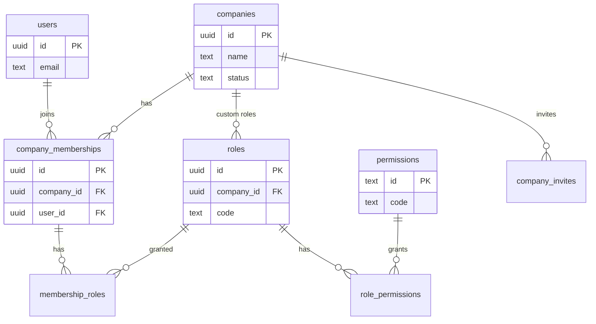
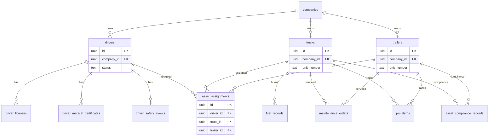
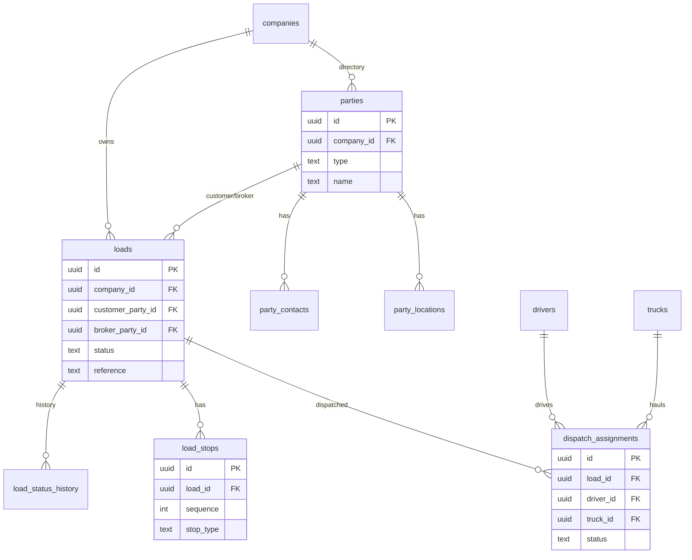
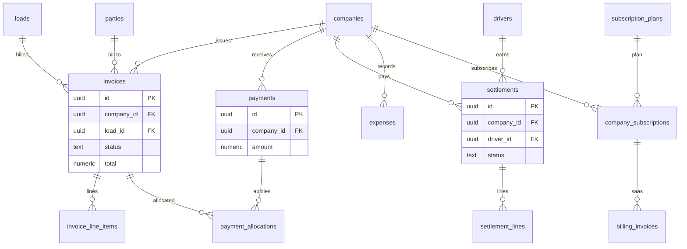
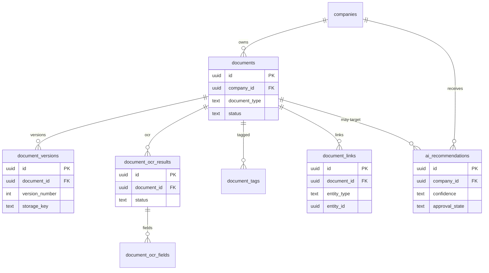
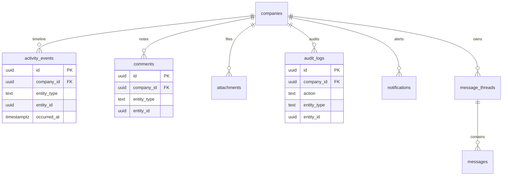
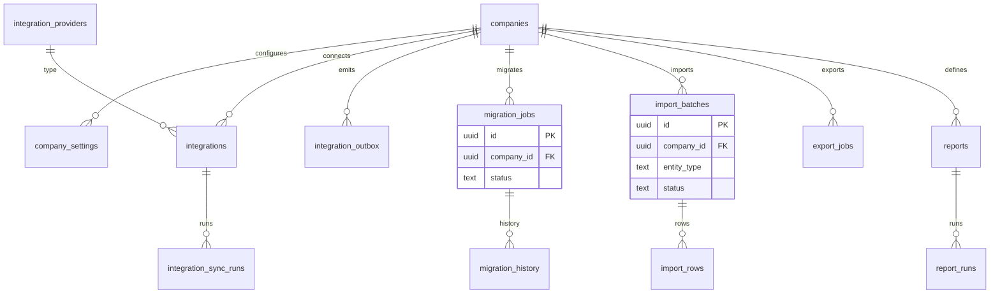

# 91 — ER Diagrams

**Status:** Documentation only — diagrams describe the target model; no tables applied.
Keep diagrams readable; details live in catalog files `10`–`70`.

---

## Identity & tenancy



---

## Fleet



---

## Operations



---

## Finance



---

## Documents & AI



---

## Cross-cutting (activity, comments, audit)



---

## Platform & migration



---

## Ownership direction reminder

```text
companies
  └── (all tenant tables via company_id)

loads ──► load_stops, dispatch_assignments
invoices ──► load_id (owner of load↔invoice link)
documents ──► versions, ocr, tags, links ──► (entity_type, entity_id)
asset_assignments ──► drivers, trucks, trailers  (no circular required FKs)
```

Return to [README.md](./README.md).
