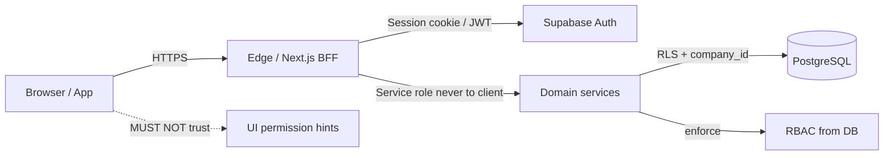

# 01 — Threat Model

**Status:** Documentation only — not yet implemented
**Parent:** [00-README.md](./00-README.md)

---

## Scope

Assets: user credentials, sessions, company data, payroll/PII, role grants, API keys (future), audit integrity.

Actors: external attackers, compromised accounts, malicious insiders, curious employees, buggy clients, compromised integrations.

Assumption: attackers can call APIs without using the UI. **Frontend permission checks are not a control boundary.**

---

## Threats and mitigations

| Threat | Impact | Mitigations |
|--------|--------|-------------|
| **Credential stuffing / password spray** | Account takeover | Argon2id/bcrypt hashes; rate limits; progressive lockout; optional CAPTCHA after N failures; breached-password checks (Have I Been Pwned style API, no plaintext to third parties); MFA |
| **Phishing / magic-link theft** | Session as victim | Short-lived single-use tokens; bind to request context where practical; notify on new device; prefer WebAuthn for high-risk tenants |
| **Session hijack (XSS / cookie theft)** | Full account use | `HttpOnly` + `Secure` + `SameSite` cookies; CSP; no tokens in `localStorage` for ops web; idle + absolute session TTL; device binding metadata; revoke on password change |
| **CSRF** | State-changing actions as user | SameSite cookies; CSRF tokens or Next.js server-action origin checks; avoid cookie auth on pure CORS public APIs |
| **Privilege escalation (client-side role spoof)** | Unauthorized mutations | Server resolves roles from DB memberships; never accept `role` / `permissions` from client body; RLS + service-layer `requirePermission` |
| **Tenant leakage** | Cross-company data exposure | Every query scoped by server `company_id`; RLS; forbid client-supplied tenant as sole authority; automated tenancy tests |
| **Invitation / token guessing** | Join wrong company | Cryptographically random invite tokens; store only hash; expiry; single use; email match on accept |
| **OAuth account takeover** | Linked identity abuse | Verified email from IdP; careful account linking rules; require re-auth to link; audit link/unlink |
| **MFA bypass** | Skip second factor | Enforce MFA at session strength claim; step-up for sensitive actions; no “remember MFA” longer than policy; recovery codes hashed |
| **Insider misuse** | Exfiltrate payroll/PII | Least privilege; sensitive-doc permissions; audit sensitive reads; owner-only impersonation; suspend path |
| **Broken object-level AuthZ (IDOR)** | Access another driver’s/load’s row | Resource load by id **and** `company_id`; optional ABAC (assigned driver) later |
| **Support / platform break-glass abuse** | Cross-tenant access | Time-boxed, reason-coded, dual control preferred, full audit; separate platform role plane |
| **AI / automation overreach** | Actions without human approval | AI runs as user or constrained principal; Constitution-critical actions require human confirmation; AI cannot grant permissions |
| **Session fixation** | Attacker forces session id | Rotate session on login / privilege change / tenant switch |
| **Brute force on reset tokens** | Password reset abuse | High-entropy tokens; rate limit; invalidate siblings on success |
| **Stale memberships** | Ex-employee access | Deactivate/suspend ends sessions; invite revoke; periodic session sweep |

---

## Trust boundaries

| Boundary | Trusted for |
|----------|-------------|
| Browser | User input only — not authz truth |
| BFF / server actions | Session validation, tenant resolution |
| Supabase Auth | Credential verification, factor proof |
| Postgres RLS | Last-line tenant isolation |
| Domain service | Business AuthZ (`permission` + resource rules) |

---

## Risk acceptance (explicit)

- Phase 1 may ship without enterprise SSO; MFA strongly recommended for Owner/Admin/Accounting.
- ABAC (resource ownership) is **optional Phase 2+**; until then, role + tenant + explicit permission is the model.
- Public track links use opaque capability tokens — **not** user sessions (see [02-authentication.md](./02-authentication.md)).

---

## Related

- [02-authentication.md](./02-authentication.md) · [08-security-controls.md](./08-security-controls.md) · [09-audit-logs.md](./09-audit-logs.md) · [03-multi-tenancy.md](./03-multi-tenancy.md)
