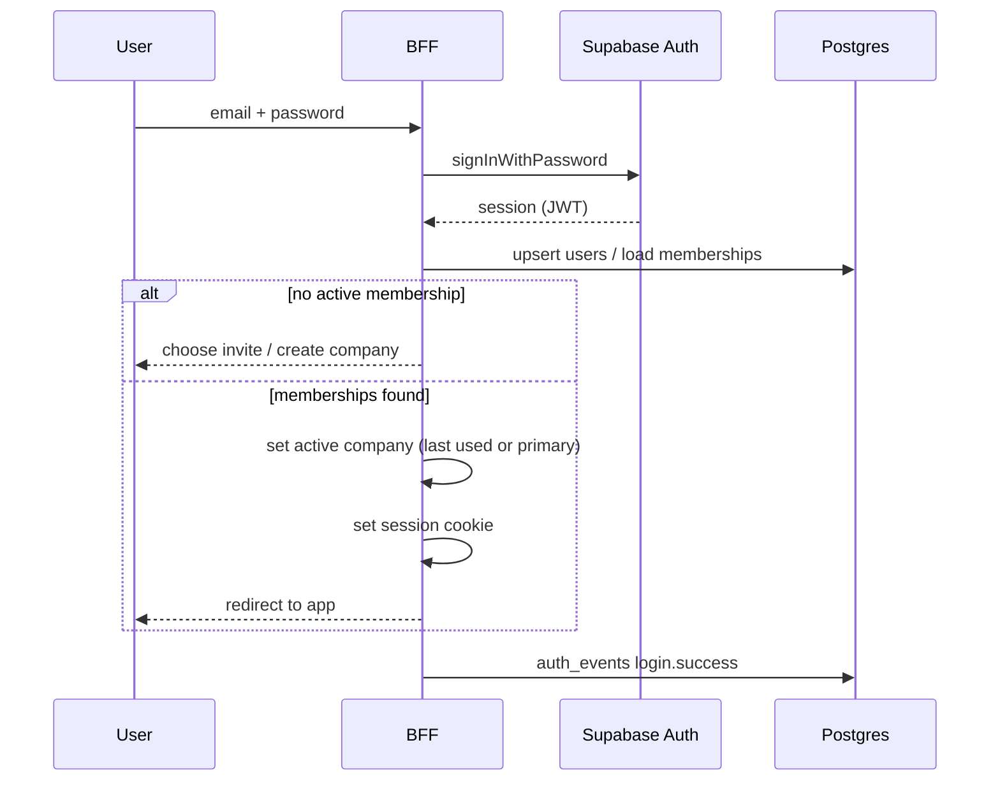
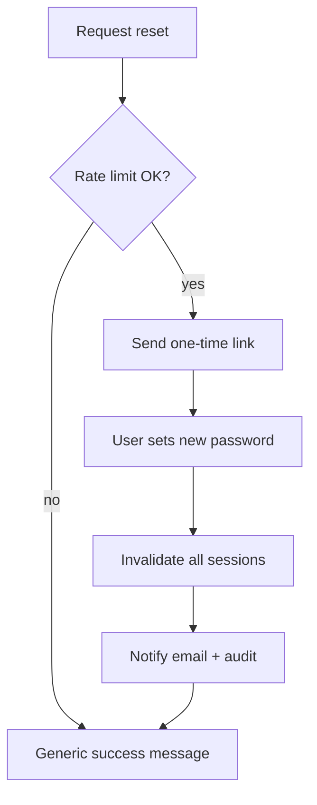
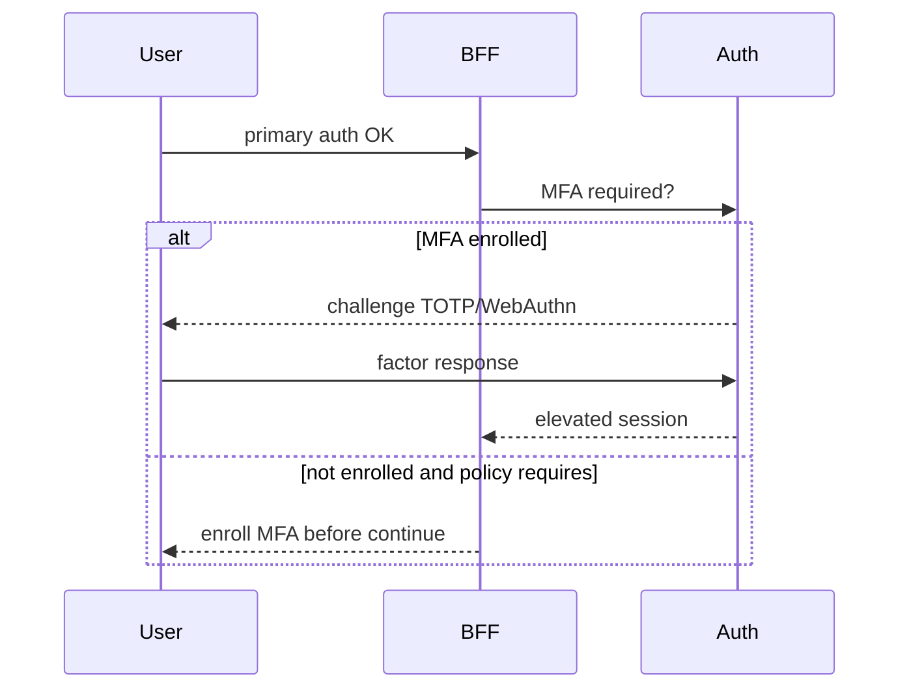

# 02 — Authentication

**Status:** Documentation only — not yet implemented
**Parent:** [00-README.md](./00-README.md)

---

## Recommended approach: Supabase Auth + app identity tables

**Decision:** Use **Supabase Auth (GoTrue)** as the primary IdP, with Transpo **application identity** in `public.users`, `identities`, `sessions`/`devices` metadata, and membership tables.

| Option | Verdict |
|--------|---------|
| **Supabase Auth + Postgres app tables** | **Recommended** — aligns with enterprise DB design; OAuth providers; JWT/session; Argon2id password hashing; RLS helpers (`auth.uid()`) |
| Fully custom AuthN | Rejected for Phase 1 — more crypto surface, slower to SSO/MFA |
| Third-party IdP only (Auth0/Clerk) | Optional later for enterprise packaging; would still map to same app tables |

**Do not overengineer:** one AuthN path. Custom code owns **membership, RBAC, tenant context, audit** — not password hashing.

Password storage: **Argon2id** (Supabase default) or **bcrypt** if a custom path is ever required. **Never plaintext. Never reversible encryption for passwords.**

---

## Principals

| Principal | Primary methods | Notes |
|-----------|-----------------|-------|
| Ops / office users | Email/password, magic link, Google/Microsoft/Apple OAuth, later SSO | MFA optional → required by role/policy |
| Drivers (future app) | Magic link / password / phone OTP (later) | Device-aware sessions; see [11-future-surfaces.md](./11-future-surfaces.md) |
| Portal (broker/customer/vendor) | Invite + password or OAuth | Separate membership surface; MFA for financial docs |
| Platform admin | SSO + MFA mandatory | Separate role plane; not a company Owner |
| Services / partners (later) | API keys / OAuth2 client credentials | [10-api-security.md](./10-api-security.md) |
| Public track links | Opaque capability tokens | Not user sessions |

---

## Authentication methods

### Email + password

1. User submits email/password to Supabase Auth (or BFF proxy).
2. On success, ensure `public.users` row exists (provision on first login).
3. Resolve active `company_membership` → issue app session context.
4. Enforce email verification before privileged actions (policy: verify before invite accept or before first mutation).

### Magic link

- Single-use, short TTL (e.g. 15–30 minutes).
- Store token hash server-side (or rely on IdP).
- Same post-login membership resolution as password.

### OAuth (Google / Microsoft / Apple)

- Use Supabase Auth providers.
- **Account linking:** if email verified matches existing user → link identity; if conflict → require password/re-auth (never silent merge of distinct accounts).
- Persist row in `identities` (`provider`, `provider_subject`).

### Two-factor authentication (2FA)

| Factor | Phase | Use |
|--------|-------|-----|
| **TOTP** (authenticator apps) | Phase 3 | Default MFA |
| **WebAuthn** (passkeys / security keys) | Phase 3–4 | Preferred for Owners / Admins |
| Recovery codes | Phase 3 | Hashed at rest; one-time |

**Step-up MFA** required (even if session is “remembered”) for: payroll approve, bank/billing change, role/permission grants, ownership transfer, migration commit, API key create.

Session claim: `auth_strength` ∈ (`password` | `oauth` | `mfa`).

### Password reset

1. Request by email → rate-limited.
2. One-time link/token (hash stored, short TTL).
3. On success: set new password; **revoke all sessions**; notify email; audit `password.changed`.

### Email verification

- Send verification on signup / email change.
- Unverified users: limited to verify + accept invite; block sensitive reads.

### Remember me

- **Ops web:** longer-lived refresh/session (e.g. 30 days) with idle timeout (e.g. 8–12 hours) and absolute max.
- Still require step-up MFA for sensitive actions.
- “Remember this device” stores device record; does not skip MFA forever.

### Device management

- Track `devices`: user agent, IP (coarse), last seen, trusted flag.
- User can revoke device → revoke associated sessions.
- New device login → email notification.

### Future SSO (SAML / OIDC)

- Phase 4 for enterprise tenants.
- Map IdP groups → built-in/custom roles via company SSO config.
- SCIM provisioning optional later (T2+).
- SSO does not bypass MFA policy if company requires it.

---

## Session / token model

```text
Supabase Auth session (JWT + refresh)
        ↓
App resolves: user_id, memberships, active company_id, roles, permissions (cached short TTL)
        ↓
Cookie: HttpOnly, Secure, SameSite=Lax|Strict
Payload used by server only: { userId, companyId, membershipId, roleIds[], authStrength, sessionId }
```

Rules:

- Client may send **no** authoritative `company_id` for AuthZ; server uses membership.
- Tenant switch re-issues session claims after membership check.
- Idle timeout + absolute lifetime; rotate on login / privilege change.
- Driver App / native may use bearer tokens bound to `device_id` with refresh rotation.

---

## Flows

### Sign-in (email/password)



### Invite accept

```mermaid
sequenceDiagram
  participant U as Invitee
  participant B as BFF
  participant A as Supabase Auth
  participant DB as Postgres

  U->>B: open invite link (token)
  B->>DB: validate invite hash + expiry
  alt new user
    U->>B: set password or OAuth
    B->>A: signUp / OAuth
  else existing user
    U->>B: authenticate
  end
  B->>DB: create membership + roles; mark invite accepted
  B->>DB: auth_events membership.joined
  B-->>U: enter company workspace
```

### Password reset



### MFA challenge



---

## Mapping from current stubs

| Current | Target |
|---------|--------|
| `getCurrentSession()` returns fake owner | Supabase session + DB membership |
| Single `role: CarrierOSRole` | `roleIds[]` + permission set |
| No password/OAuth | Supabase Auth methods above |

---

## Related

- [03-multi-tenancy.md](./03-multi-tenancy.md) · [08-security-controls.md](./08-security-controls.md) · [12-data-model.md](./12-data-model.md) · DB [`../database/10-identity-tenancy.md`](../database/10-identity-tenancy.md)
