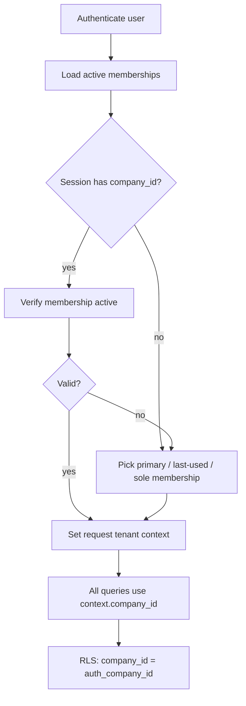

# 03 — Multi-Tenancy

**Status:** Documentation only — not yet implemented
**Parent:** [00-README.md](./00-README.md)
**Database:** [`../database/10-identity-tenancy.md`](../database/10-identity-tenancy.md) · [`../database/81-security-rls.md`](../database/81-security-rls.md)

---

## Goal

Every **company** (carrier tenant) is fully isolated at:

| Layer | Enforcement |
|-------|-------------|
| **Database** | `company_id` on business rows + **Supabase RLS** |
| **API** | Tenant context middleware from membership — never trust client `company_id` alone |
| **UI** | Scoped queries / nav; hiding is UX only |

**Never cross-tenant access** for normal product paths. Platform break-glass is separate, audited, and out of band (see Impersonation).

---

## Tenant root

- Tenant = row in `companies`.
- Today’s `tenantId` / `getActiveCompany()` maps to `companies.id`.
- Global catalogs (`permissions`, plan types, connector definitions) have **no** `company_id`.

---

## Membership model

```text
users  ←—— company_memberships ——→  companies
                  │
                  └── membership_roles → roles → role_permissions → permissions
```

| Concept | Rule |
|---------|------|
| User | Global person; may belong to **multiple** companies |
| Membership | Binding of user ↔ company with status (`invited` \| `active` \| `suspended` \| `deactivated`) |
| Active tenant | Exactly one `company_id` in the current session |
| Roles | Assigned **per membership**, not globally |
| Driver link | Optional `memberships.driver_id` for Driver App users |

Invariants:

1. At least one **active Owner** membership per company (app-enforced).
2. Unique `(company_id, user_id)` among non-deleted memberships.
3. Custom roles’ `company_id` must match membership’s company.
4. Suspended/deactivated memberships cannot become the active tenant.

---

## Tenant context resolution



**API middleware (conceptual order):** authenticate → resolve user → resolve membership/tenant → attach context → AuthZ → handler.
See [10-api-security.md](./10-api-security.md).

---

## Isolation rules

1. Inserts set `company_id` from context, never from untrusted body alone.
2. Updates/deletes never change `company_id`.
3. Cross-tenant joins forbidden in app queries.
4. List endpoints always filter by context company.
5. Get-by-id: `WHERE id = ? AND company_id = ?` (or equivalent RLS).
6. Storage paths (documents) include `company_id` prefix; signed URLs scoped.
7. Search indexes are tenant-partitioned or always filter `company_id`.
8. Background jobs carry `company_id` + actor; workers re-check AuthZ.

---

## Multi-company users

- User switches company via explicit UI action.
- Switch **re-validates** membership and **rotates** session claims.
- Permissions recompute for the new membership (roles differ per company).
- Audit: `tenant.switched`.

---

## Impersonation (support / Owner)

Product impersonation (view-as) is **dangerous**. Rules if offered:

| Rule | Detail |
|------|--------|
| **Who** | Company **Owner** only for in-tenant “view as user”; platform support uses separate break-glass |
| **Scope** | Same `company_id` only — never cross-tenant via Owner impersonation |
| **Duration** | Short TTL (e.g. ≤ 1 hour); hard stop |
| **Capabilities** | Prefer read-only or restricted mutation set; **never** allow ownership transfer or billing while impersonating |
| **Audit** | Required: actor, target, reason, start/end; visible in company audit |
| **UI banner** | Persistent “Impersonating …” with Exit |
| **AI** | Impersonation sessions cannot raise automation level or skip confirmations |

Platform break-glass (Transpo staff):

- Separate platform role plane (`platform_admin`).
- Time-boxed, reason-coded, optional dual approval.
- Full audit; customer-visible notice where legally required.

**Default recommendation:** ship without user impersonation in Phase 1; add only when support need is proven.

---

## Testing tenancy

Minimum automated checks (when implemented):

- User A cannot read/write company B rows by ID.
- Forged `company_id` header/body ignored.
- Suspended membership rejected.
- RLS denials logged at debug without leaking other tenants.

---

## Related

- [04-roles.md](./04-roles.md) · [07-team-management.md](./07-team-management.md) · [12-data-model.md](./12-data-model.md) · [`../database/02-cross-cutting.md`](../database/02-cross-cutting.md)
