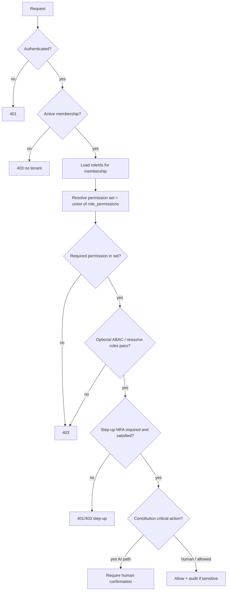

# 05 — Permissions

**Status:** Documentation only — not yet implemented
**Parent:** [00-README.md](./00-README.md)
**Roles:** [04-roles.md](./04-roles.md) · DB [`../database/10-identity-tenancy.md`](../database/10-identity-tenancy.md)

---

## Design rules

1. **Deny by default** — missing grant ⇒ denied.
2. Permissions are **independently assignable** (via roles); never inferred from UI visibility.
3. **Namespaced codes:** `resource:action` (stable public AuthZ vocabulary).
4. **Never trust the client** — every mutation re-checks on the server.
5. AI / automations inherit the **acting user’s** (or constrained service principal’s) permissions; AI cannot grant permissions (Constitution).

### Evolution from current catalog

Today (`lib/permissions/permissions-catalog.ts`):

- `page.loads.view`, `button.loads.create`, `document.rate_con.download`

**Target:** normalize to `loads:view`, `loads:create`, `documents:rate_con:download` (or `documents.rate_con:download`).

During migration, maintain a **compatibility map**; do not fork a second AuthZ system.

---

## Actions (standard verbs)

| Action | Meaning |
|--------|---------|
| `view` | Read / list |
| `create` | Create |
| `edit` | Update |
| `delete` | Delete / cancel / soft-delete |
| `approve` | Human approval of a critical or gated action |
| `assign` | Assign people/assets |
| `export` | Export / download bulk data |
| `share` | Share externally or via portal |
| `upload` | Upload files |
| `download` | Download a document |
| `manage` | Administer configuration for that resource |
| `invite` | Invite users (users module) |
| `impersonate` | Owner view-as (if enabled) |

---

## Permission catalog (comprehensive)

Codes below are the design target. Modules mirror Transpo product surfaces.

### Loads / dispatch

| Code | Description |
|------|-------------|
| `loads:view` | View loads and board |
| `loads:create` | Create loads |
| `loads:edit` | Edit load details |
| `loads:delete` | Cancel / delete loads |
| `loads:assign` | Assign driver / truck / trailer |
| `loads:approve` | Approve load / rate (if gated) |
| `loads:export` | Export load data |
| `loads:share` | Share tracking / docs with broker |
| `loads:tracking:view` | Live tracking |
| `loads:tracking:replay` | Historical replay |

### Drivers / workforce

| Code | Description |
|------|-------------|
| `drivers:view` | View driver directory |
| `drivers:create` | Add driver |
| `drivers:edit` | Edit driver profile |
| `drivers:delete` | Deactivate / remove driver record |
| `drivers:assign` | Assign to load / unit |
| `drivers:documents:view` | View driver docs |
| `drivers:documents:manage` | Upload/manage driver docs |
| `drivers:safety:view` | Safety scores / incidents on driver |
| `drivers:payroll:view` | Driver pay summary |
| `drivers:invite` | Invite driver to Driver App |

### Fleet (trucks / trailers)

| Code | Description |
|------|-------------|
| `fleet:view` | View fleet |
| `fleet:trucks:view` | View trucks |
| `fleet:trucks:create` | Add truck |
| `fleet:trucks:edit` | Edit truck |
| `fleet:trucks:delete` | Remove truck |
| `fleet:trailers:view` | View trailers |
| `fleet:trailers:create` | Add trailer |
| `fleet:trailers:edit` | Edit trailer |
| `fleet:trailers:delete` | Remove trailer |
| `fleet:assign` | Assign units to drivers/loads |
| `fleet:export` | Export fleet data |

### Maintenance

| Code | Description |
|------|-------------|
| `maintenance:view` | View work orders / PM |
| `maintenance:create` | Create work order |
| `maintenance:edit` | Edit work order |
| `maintenance:delete` | Delete work order |
| `maintenance:manage` | Schedule / close / assign shop work |
| `maintenance:documents:manage` | Maintenance document uploads |

### Documents

| Code | Description |
|------|-------------|
| `documents:view` | Documents library |
| `documents:upload` | Upload |
| `documents:edit` | Edit metadata |
| `documents:delete` | Delete |
| `documents:share` | Share |
| `documents:export` | Bulk export |
| `documents:packets:view` | Load packets |
| `documents:packets:manage` | Build / send packets |
| `documents:health:view` | Document health dashboard |
| `documents:rate_con:view` / `:download` / `:upload` / `:delete` / `:share` | Rate confirmation |
| `documents:pod:view` / `:download` / `:upload` / `:delete` / `:share` | POD |
| `documents:bol:view` / `:download` / `:upload` / `:delete` / `:share` | BOL |
| `documents:invoice:view` / `:download` / `:upload` / `:delete` / `:share` | Invoice docs |
| `documents:insurance:view` / `:download` / `:upload` / `:delete` / `:share` | Insurance |
| `documents:cdl:view` / `:download` / `:upload` / `:delete` / `:share` | CDL |
| `documents:medical:view` / `:download` / `:upload` / `:delete` / `:share` | Medical / DOT |
| `documents:accident:view` / `:download` / `:upload` / `:delete` / `:share` | Accident |
| `documents:maintenance:view` / `:download` / `:upload` / `:delete` / `:share` | Maint records |
| `documents:ssn_secured:view` / `:download` / `:upload` / `:delete` | Secured PII (high sensitivity) |

### Compliance / safety

| Code | Description |
|------|-------------|
| `compliance:view` | Compliance hub |
| `compliance:create` | Report incident / create item |
| `compliance:edit` | Edit compliance records |
| `compliance:approve` | Approve compliance item |
| `compliance:export` | Export compliance reports |
| `safety:view` | Safety dashboards |
| `safety:manage` | Safety programs / coaching |

### Finance / accounting

| Code | Description |
|------|-------------|
| `finance:view` | Finance hub |
| `finance:invoices:view` | View invoices |
| `finance:invoices:create` | Create invoice |
| `finance:invoices:edit` | Edit invoice |
| `finance:invoices:delete` | Void / delete |
| `finance:payments:view` | View payments |
| `finance:payments:create` | Record payment |
| `finance:payments:approve` | Approve payment / disbursement |
| `finance:settlements:view` | View settlements |
| `finance:settlements:manage` | Manage settlements |
| `accounting:view` | Accounting views |
| `accounting:export` | Export GL / books data |
| `ifta:view` | IFTA |
| `ifta:manage` | Prepare / manage IFTA |
| `ifta:approve` | Approve IFTA filing package (human) |

### Payroll

| Code | Description |
|------|-------------|
| `payroll:view` | View payroll |
| `payroll:create` | Run / prepare payroll |
| `payroll:edit` | Edit payroll draft |
| `payroll:approve` | Approve payroll (step-up MFA) |
| `payroll:export` | Export payroll |
| `payroll:self:view` | Driver views own pay |

### Reports / analytics

| Code | Description |
|------|-------------|
| `reports:view` | Analytics / reports |
| `reports:create` | Create saved reports |
| `reports:export` | Export reports |
| `reports:manage` | Manage report schedules |

### Import / migration / export

| Code | Description |
|------|-------------|
| `import:view` | View imports |
| `import:create` | Start import |
| `import:manage` | Manage import jobs |
| `migration:view` | Migration Center |
| `migration:manage` | Configure migration |
| `migration:commit` | Commit migration (human + step-up) |
| `export:create` | Data export jobs |

### Users / roles / team

| Code | Description |
|------|-------------|
| `users:view` | View team |
| `users:invite` | Invite members |
| `users:edit` | Edit membership profile/title |
| `users:suspend` | Suspend member |
| `users:remove` | Remove member |
| `users:impersonate` | Owner view-as (if enabled) |
| `roles:view` | View roles |
| `roles:manage` | Create/edit custom roles & assignments |
| `roles:assign` | Assign roles to members |

### Settings / billing / integrations

| Code | Description |
|------|-------------|
| `settings:view` | View settings |
| `settings:edit` | Edit workspace settings |
| `settings:manage` | Advanced admin settings |
| `billing:view` | View billing |
| `billing:manage` | Change plan / payment method (Owner) |
| `integrations:view` | View integrations |
| `integrations:manage` | Connect / disconnect integrations |
| `integrations:eld:manage` | ELD connectors |
| `api_keys:view` | View API keys (future) |
| `api_keys:manage` | Create/revoke API keys (future) |

### Communications / notifications / network / exchange

| Code | Description |
|------|-------------|
| `communications:view` | Comms inbox |
| `communications:send` | Send messages |
| `communications:manage` | Templates / routing |
| `notifications:manage` | Notification preferences (admin) |
| `network:view` | Network directory |
| `network:manage` | Company network presence |
| `exchange:view` | Exchange / marketplace browse |
| `exchange:manage` | List / sell / buy actions |
| `marketplace:view` | Marketplace |
| `marketplace:manage` | Marketplace seller tools |

### Brokers / companies / customers (CRM-ish)

| Code | Description |
|------|-------------|
| `brokers:view` / `brokers:create` / `brokers:edit` / `brokers:delete` | Brokers |
| `companies:view` / `companies:create` / `companies:edit` | Counterparty companies |
| `customers:view` / `customers:create` / `customers:edit` | Customers |
| `portal:view` | Customer portal ops view |
| `portal:manage` | Portal access grants |

### Alph / AI / workflows / platform (company-scoped)

| Code | Description |
|------|-------------|
| `alph:view` | Use Alph suggestions |
| `alph:manage` | Company Alph settings (not Constitution bypass) |
| `workflows:view` | View workflows |
| `workflows:edit` | Edit workflow definitions |
| `workflows:manage` | Manage runs |
| `automation:manage` | Automation level settings (within AI safety) |

### Wallet / expenses (if enabled)

| Code | Description |
|------|-------------|
| `wallet:view` | View wallet |
| `wallet:manage` | Manage wallet (sensitive) |
| `expenses:view` / `expenses:create` / `expenses:approve` | Expenses |

---

## Evaluation algorithm



### Pseudocode

```text
function authorize(actor, companyId, permission, resource?):
  deny if not authenticated
  membership = activeMembership(actor, companyId)
  deny if membership missing or not active
  perms = cache.get(membership.id) or union(roles → permissions)
  deny if permission not in perms
  if resource:
    deny if resource.company_id != companyId
    # optional ABAC later: assigned driver, record lock, etc.
  if requiresStepUp(permission):
    deny unless actor.auth_strength >= mfa
  if isCriticalConstitutionAction(permission, context):
    require human confirmation path (AI cannot auto-approve)
  audit if isSensitive(permission, resource)
  allow
```

**Caching:** short TTL in-process/Redis per `membership_id`; invalidate on role/permission/membership change.

---

## UI vs server

| Layer | Allowed |
|-------|---------|
| UI | Hide/disable controls for UX |
| Server / service | **Authoritative** `requirePermission` |
| RLS | Tenant isolation + optional permission helpers later |

---

## Related

- [04-roles.md](./04-roles.md) · [06-custom-roles.md](./06-custom-roles.md) · [10-api-security.md](./10-api-security.md)
