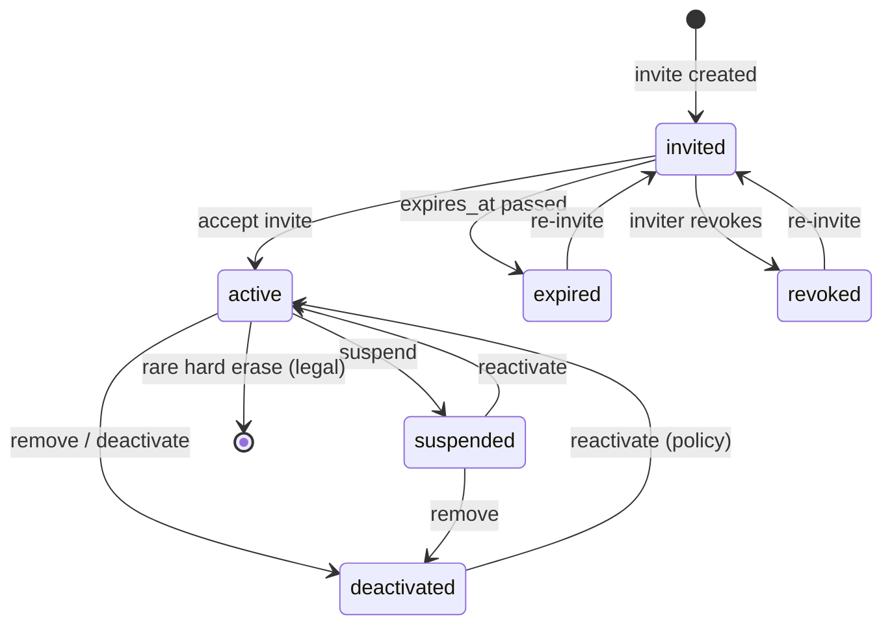

# 07 — Team Management

**Status:** Documentation only — not yet implemented
**Parent:** [00-README.md](./00-README.md)
**Tenancy:** [03-multi-tenancy.md](./03-multi-tenancy.md) · **Roles:** [04-roles.md](./04-roles.md)

---

## Membership lifecycle

Company access is gated by **membership status**, not only by AuthN.

### State machine

| Status | Can authenticate to company? | Notes |
|--------|------------------------------|-------|
| `invited` | No (until accept) | Pending `company_invites` / membership |
| `active` | Yes | Normal |
| `suspended` | No | Temporary; sessions revoked |
| `deactivated` | No | Soft end of access; retain audit history |
| `expired` / `revoked` | No | Invite terminal states |

---

## Operations

### Invite

1. Actor with `users:invite` selects email, roles, optional department/title.
2. Create invite with hashed token, `expires_at` (e.g. 7 days).
3. Email magic link; do not leak whether email already exists in other tenants beyond what’s needed.
4. On accept: create/activate membership, attach roles, mark invite `accepted`.
5. Audit: `invite.created`, `invite.accepted`.

**Constraints:** cannot invite with roles/permissions the inviter cannot grant (optional policy — [06-custom-roles.md](./06-custom-roles.md)). Cannot grant Owner via invite except existing Owner transferring (prefer transfer flow).

### Remove

- Soft-delete or set `deactivated`.
- Revoke sessions for that membership.
- Cannot remove last Owner.
- Audit: `membership.removed`.

### Deactivate vs suspend

| Action | Intent | Reversible |
|--------|--------|------------|
| **Suspend** | Temporary hold (investigation, leave) | Yes → reactivate |
| **Deactivate / remove** | End employment access | Reactivate only with admin policy |

Both clear active sessions.

### Reactivate

- Requires `users:edit` or `users:invite`.
- Restores prior roles unless explicitly changed.
- Audit: `membership.reactivated`.

### Transfer ownership

See [04-roles.md](./04-roles.md#ownership-transfer). Step-up MFA; audit; no impersonation.

---

## Profile fields (membership-scoped)

| Field | Purpose |
|-------|---------|
| `title` | Job title |
| `department` | Optional org unit string or FK later |
| `employee_status` | e.g. `employee`, `contractor`, `temporary` (HR hint; not AuthZ by itself) |
| `is_primary_contact` | Billing/ops contact flag |
| `driver_id` | Link to `drivers` when membership is a driver user |

AuthZ remains **roles → permissions**. Department/employee_status are for UX, reporting, and future ABAC — not silent privilege.

---

## Session impact matrix

| Event | Sessions |
|-------|----------|
| Suspend / deactivate / remove | Revoke membership sessions immediately |
| Role change | Rotate claims / invalidate permission cache |
| Password change | Revoke all user sessions |
| Ownership transfer | Rotate both users’ company sessions |

---

## Related

- [02-authentication.md](./02-authentication.md) · [08-security-controls.md](./08-security-controls.md) · [12-data-model.md](./12-data-model.md)
