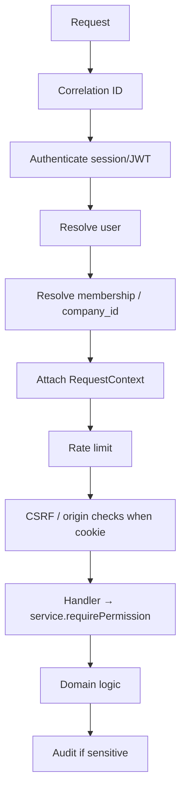

# 10 — API Security

**Status:** Documentation only — not yet implemented
**Parent:** [00-README.md](./00-README.md)
**APIs overview:** [`../06-apis.md`](../06-apis.md)

---

## Hard rule

**Never trust the client for permissions, role, or `company_id`.**
UI checks are convenience. Every Server Action, Route Handler, and worker entrypoint re-validates AuthN + tenant + permission (+ resource rules).

---

## Endpoint protection

| Client | AuthN | AuthZ |
|--------|-------|-------|
| Ops web | Session cookie (Supabase + app context) | RBAC permission on use-case |
| Driver App | Session / bearer + device | Narrow driver permissions + assignment ABAC later |
| Portal | Session | Portal-scoped permissions |
| Public API (future) | OAuth2 / API keys | Scoped subset of catalog |
| Webhooks inbound | HMAC + timestamp | Provider key → company mapping |
| Track links | Opaque capability token | Token ACL only |

---

## Middleware order (BFF / Route Handlers)



Workers: hydrate `RequestContext` from job payload; **re-check** membership still active and permission still held before side effects.

---

## Service-layer checks

```text
loadService.assignDriver(ctx, loadId, driverId):
  ctx.requirePermission("loads:assign")
  load = repo.get(loadId, ctx.companyId)  # tenant-scoped
  ...
```

Patterns:

- `requireAuth(ctx)`
- `requirePermission(ctx, code)`
- `requireStepUp(ctx)` for sensitive codes
- `requireHumanConfirmation` for Constitution-critical AI paths

Do not sprinkle ad-hoc role string checks (`if role === owner`) except for Owner-only invariants (billing, ownership). Prefer permissions.

---

## Public / partner API keys (later)

| Topic | Design |
|-------|--------|
| Representation | `api_keys` table: prefix + **hash**, scopes[], `company_id`, created_by |
| Scopes | Subset of permission catalog (`loads:view`, …) |
| Rotation | Create new + revoke old; audit |
| Rate limits | Per key + company |
| Never | Put service-role Supabase keys in clients |

OAuth2 client-credentials for partners may coexist; map to service principal membership.

---

## Error hygiene

| Case | Response |
|------|----------|
| Unauthenticated | 401 |
| Authenticated, wrong tenant / no permission | 403 (do not confirm other tenants’ existence) |
| Not found in tenant | 404 |
| Step-up needed | 401/403 with `code: step_up_required` |

---

## Related

- [03-multi-tenancy.md](./03-multi-tenancy.md) · [05-permissions.md](./05-permissions.md) · [11-future-surfaces.md](./11-future-surfaces.md)
