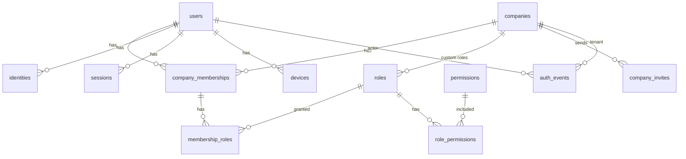

# 12 — IAM Data Model

**Status:** Documentation only — **no SQL migrations in this task**
**Parent:** [00-README.md](./00-README.md)
**Canonical table docs:** [`../database/10-identity-tenancy.md`](../database/10-identity-tenancy.md) · audit [`../database/60-comms-audit.md`](../database/60-comms-audit.md)

This document extends the enterprise DB identity design with auth-specific entities (`identities`, `sessions`, `devices`, `auth_events`) and summarizes PKs/FKs/indexes. Illustrative only — **NOT APPLIED**.

---

## Entity relationship (logical)

Supabase `auth.users` is external; `public.users.auth_user_id` links logically.

---

## Tables

### users

| Aspect | Summary |
|--------|---------|
| PK | `id` uuid |
| Unique | `email` where not deleted; `auth_user_id` |
| Key cols | `email`, `full_name`, `phone`, `status`, `mfa_enabled`, `last_login_at` |
| Tenancy | Global person — **no** `company_id` |

Aligns with [`../database/10-identity-tenancy.md`](../database/10-identity-tenancy.md#users).

### identities

| Aspect | Summary |
|--------|---------|
| Purpose | Linked AuthN providers (email, google, microsoft, apple, saml) |
| PK | `id` uuid |
| FK | `user_id` → `users` |
| Unique | `(provider, provider_subject)` |
| Indexes | `(user_id)` |
| Key cols | `provider`, `provider_subject`, `email_at_link`, `linked_at` |

### sessions

| Aspect | Summary |
|--------|---------|
| Purpose | App-tracked sessions (may mirror/refresh IdP session ids) |
| PK | `id` uuid |
| FK | `user_id` → `users`; optional `device_id` → `devices`; optional `company_id` active tenant |
| Indexes | `(user_id, revoked_at)`, `(expires_at)` |
| Key cols | `auth_strength`, `ip`, `user_agent`, `expires_at`, `revoked_at`, `absolute_expires_at` |

If Supabase fully owns session storage, this table may store **metadata only** — still useful for device revoke UX.

### devices

| Aspect | Summary |
|--------|---------|
| Purpose | Device tracking / trust |
| PK | `id` uuid |
| FK | `user_id` → `users` |
| Indexes | `(user_id, revoked_at)` |
| Key cols | `label`, `user_agent`, `last_ip`, `last_seen_at`, `trusted_at`, `revoked_at` |

### companies

Tenant root — see database doc. PK `id`; no `company_id` on itself.

### company_memberships

| Aspect | Summary |
|--------|---------|
| PK | `id` uuid |
| FK | `company_id` → `companies`; `user_id` → `users`; optional `driver_id` |
| Unique | `(company_id, user_id)` where active/not deleted |
| Status | `invited` \| `active` \| `suspended` \| `deactivated` |
| Key cols | `title`, `department`, `employee_status`, `is_primary_contact` |

### roles

| Aspect | Summary |
|--------|---------|
| PK | `id` uuid |
| FK | `company_id` → `companies` **nullable** (null = built-in) |
| Unique | `(company_id, name)` custom; `code` for built-ins |
| Key cols | `code`, `name`, `built_in`, `description` |

### permissions

| Aspect | Summary |
|--------|---------|
| PK | `id` text **or** uuid + unique `code` |
| Unique | `code` (`loads:view`, …) |
| Tenancy | Global — no `company_id` |
| Key cols | `code`, `resource`, `action`, `label`, `is_sensitive`, `is_active` |

### role_permissions

| Aspect | Summary |
|--------|---------|
| PK | `id` uuid or `(role_id, permission_id)` |
| FK | `role_id` → `roles`; `permission_id` → `permissions` |
| Unique | `(role_id, permission_id)` |

### membership_roles

| Aspect | Summary |
|--------|---------|
| PK | `id` uuid |
| FK | `membership_id` → `company_memberships`; `role_id` → `roles` |
| Unique | `(membership_id, role_id)` where active |
| Constraint | role company null or equals membership company |

### company_invites (invitations)

| Aspect | Summary |
|--------|---------|
| PK | `id` uuid |
| FK | `company_id` → `companies`; `invited_by` → `users` |
| Unique | `token_hash` |
| Indexes | `(company_id, email)` pending |
| Key cols | `email`, `role_ids` jsonb or invite_roles M:N, `expires_at`, `status` |

### auth_events

| Aspect | Summary |
|--------|---------|
| Purpose | AuthN / security stream |
| PK | `id` uuid |
| FK | `actor_user_id` → `users` (nullable for failures); `company_id` optional |
| Indexes | `(company_id, occurred_at DESC)`, `(actor_user_id, occurred_at DESC)`, `(event_type, occurred_at DESC)` |
| Key cols | `event_type`, `ip`, `user_agent`, `payload`, `occurred_at`, `correlation_id` |

Privileged config changes may also write `audit_logs` (database cross-cutting).

---

## Index summary (checklist)

| Table | Indexes |
|-------|---------|
| users | unique email; auth_user_id |
| identities | unique (provider, provider_subject); user_id |
| sessions | user_id+revoked; expires_at |
| devices | user_id+revoked |
| company_memberships | unique (company_id, user_id); user_id |
| roles | unique built-in code; unique (company_id, name) |
| permissions | unique code; (resource, action) |
| role_permissions | unique (role_id, permission_id) |
| membership_roles | unique (membership_id, role_id) |
| company_invites | token_hash; (company_id, email) pending |
| auth_events | company+time; actor+time; type+time |

---

## RLS notes

- Business tables: `company_id = auth_company_id()` ([`../database/81-security-rls.md`](../database/81-security-rls.md)).
- `users`: users read self; company admins read members via membership join policies.
- `permissions`: read-all authenticated; write platform only.
- `auth_events`: company admins read own tenant; users read own events.

---

## Related

- [02-authentication.md](./02-authentication.md) · [03-multi-tenancy.md](./03-multi-tenancy.md) · [13-implementation-roadmap.md](./13-implementation-roadmap.md)
