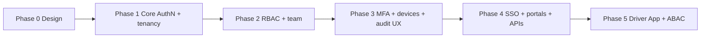
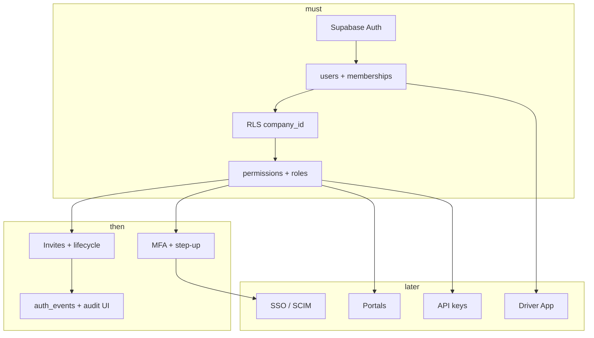

# 13 — Implementation Roadmap

**Status:** Documentation only — **no code, migrations, or login UI in this task**
**Parent:** [00-README.md](./00-README.md)

This roadmap sequences delivery so AuthN/AuthZ stays safer and simpler before enterprise extras. Phases are design guidance; product may merge steps if risk stays low.

---

## Principles for delivery

1. **Constitution first** — humans control critical actions; AI never grants permissions.
2. **Backend enforcement before polish** — RLS + `requirePermission` before fancy role UIs.
3. **One IdP path** — Supabase Auth; app owns memberships/RBAC/audit.
4. **Evolve stubs** — map `lib/auth/session.ts` and `lib/permissions/*` rather than a parallel AuthZ system.
5. **No SQL until design approval** — see [`../database/README.md`](../database/README.md).

---

## Phase overview

| Phase | Outcome | Exit criteria |
|-------|---------|---------------|
| **0** | Design locked (this pack + DB identity) | Stakeholder review; no open AuthZ model conflicts |
| **1** | Real login + memberships + tenant isolation | No stub session in prod paths; RLS on core tables; email/password + magic link |
| **2** | Built-in roles, custom roles, invites | Permission checks on mutations; Owner/Admin can manage team |
| **3** | MFA, devices, security notifications, audit views | Step-up on sensitive actions; device revoke works |
| **4** | SSO, portal principals, API keys | Enterprise SSO optional; partner portal AuthZ; scoped keys |
| **5** | Driver App plane + optional ABAC | Driver role + assignment scope; mobile-ready sessions |

---

## Phase 0 — Design lock (current)

| Work | Notes |
|------|-------|
| IAM pack (this folder) | Authoritative AuthN/AuthZ design |
| DB identity tables | [`../database/10-identity-tenancy.md`](../database/10-identity-tenancy.md) |
| Align thin summary | [`../05-auth-authorization.md`](../05-auth-authorization.md) points here |
| Threat model accepted | [01-threat-model.md](./01-threat-model.md) |

**Deliverable:** approved design — **not** migrations.

---

## Phase 1 — Core authentication & multi-tenancy

| Work | Detail |
|------|--------|
| Supabase Auth | Email/password, magic link; Argon2id; email verification |
| App users | Provision `public.users` on first login; link `auth_user_id` |
| Memberships | `company_memberships` with active tenant in session |
| Tenant middleware | Server-derived `company_id`; ignore client-only tenant |
| RLS | Enable on core business tables ([`../database/81-security-rls.md`](../database/81-security-rls.md)) |
| Sessions | HttpOnly cookies; idle + absolute TTL; password reset revokes sessions |
| Replace stub | Retire hardcoded `CarrierOSSession` for ops web |

**Out of scope for Phase 1:** SSO, custom role UI polish, Driver App, public API keys, impersonation.

**Auth methods at end of Phase 1:** email/password, magic link, password reset, email verification, basic sessions (± remember me).

---

## Phase 2 — RBAC, permissions, team lifecycle

| Work | Detail |
|------|--------|
| Seed built-in roles | Owner → Read Only (+ Driver reserved) per [04-roles.md](./04-roles.md) |
| Permission catalog | DB `permissions` + migration map from `page.*` / `button.*` |
| Custom roles | Unlimited per company ([06-custom-roles.md](./06-custom-roles.md)) |
| Team ops | Invite, remove, deactivate, suspend, reactivate, ownership transfer |
| Profile fields | department, employee_status, title |
| Service checks | `requirePermission` on Server Actions / APIs |
| OAuth (optional same phase) | Google / Microsoft / Apple via Supabase |

**Exit criteria:** every mutating endpoint checks permission + tenant; UI hide is non-authoritative.

---

## Phase 3 — Hardening (MFA, devices, audit)

| Work | Detail |
|------|--------|
| TOTP MFA | Enroll + challenge; recovery codes hashed |
| Step-up | Payroll, billing, role grants, ownership, migration commit |
| Devices | List/revoke; new-device login email |
| Rate limits / lockout | Login, reset, MFA ([08-security-controls.md](./08-security-controls.md)) |
| Auth events + audit UI | [09-audit-logs.md](./09-audit-logs.md) |
| WebAuthn | Preferred for Owner/Admin (can start late Phase 3) |

---

## Phase 4 — Enterprise & external surfaces

| Work | Detail |
|------|--------|
| SSO | SAML / OIDC; group → role mapping; SCIM later |
| Portals | Partner / Customer / Vendor invite + narrow perms |
| Marketplace / Exchange | `exchange:*` / `marketplace:*` without ops Owner powers |
| Public APIs | API keys (hashed) + OAuth2 client credentials; scopes ⊂ catalog |
| Platform plane | Separate `platform_admin`; break-glass audited |

---

## Phase 5 — Driver App & optional ABAC

| Work | Detail |
|------|--------|
| Driver membership | `driver_id` + Driver role |
| Mobile sessions | Refresh rotation; OS keychain; device binding |
| ABAC (optional) | Assigned-load / self-resource rules on top of RBAC |
| Phone OTP | Optional AuthN method; same `users` row |

---

## Dependency sketch

---

## Explicit non-goals (all phases unless re-approved)

- Parallel AuthZ systems (keep one catalog)
- AI-granted privileges or silent privilege escalation
- Cross-tenant product “superuser” without break-glass rules
- Shipping login UI from this documentation task alone
- Generating SQL migrations before DB design approval

---

## Suggested engineering order inside a phase

1. Schema (approved) → 2. AuthN wiring → 3. Tenant context → 4. RLS → 5. Permission seed → 6. Service guards → 7. Team/admin UI → 8. MFA/devices → 9. Audit views → 10. External surfaces.

---

## Related

- [00-README.md](./00-README.md) · [02-authentication.md](./02-authentication.md) · [12-data-model.md](./12-data-model.md) · [`../14-scalability-roadmap.md`](../14-scalability-roadmap.md)
