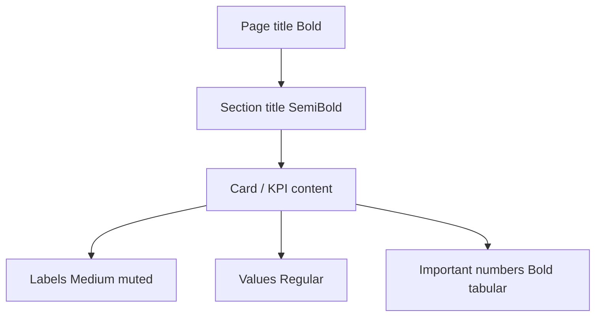

# 01 — Design Principles

**Documentation only.** These principles govern every Transpo.ai UI decision.

---

## Design goal

Transpo.ai is **not a TMS**. It is a premium trucking operating platform that feels:

- **Premium & minimal** — Apple / Linear calm
- **Professional & fast** — Stripe / Vercel clarity
- **Enterprise-ready** — Notion density without clutter; GitHub information hierarchy; Raycast command speed

Users should feel confident within two seconds of landing on any screen.

---

## Screen test (required)

Every view must answer, at a glance:

1. **What happened?** — Current state in plain language
2. **What needs attention?** — Problems, blockers, expirations, exceptions
3. **What next?** — Primary action(s), one click when possible

Extended (product-design rule) when useful:

4. Who to contact?
5. Can I finish this in one click / one modal?

If a control does nothing meaningful, remove it or disable it with a tooltip reason (`ActionTooltip` pattern).

---

## Cognitive load

| Do | Don’t |
|----|--------|
| Show only what matters now | Dump every column/field by default |
| Progressive disclosure | Nested chrome, pill clusters, icon soup |
| Plain language | Internal codes without labels |
| Spacing + type for structure | Boxes inside boxes, heavy grids |
| Comfortable body text (≥14px values) | Tiny dense tables as the default UX |
| Intentional completeness | Empty white voids or sparse unfinished panels |

**No empty white pages** — use skeletons on canvas `#F5F7FA`, shimmer, then fade-in (see [11-motion.md](./11-motion.md)).

---

## Low-click operations

Primary ops actions should open a **single modal or preview**, not a multi-page wizard unless legally/compliance-required:

- Assign driver / equipment
- Send rate confirmation
- Request POD
- Invoice
- Notify broker

Secondary settings stay behind progressive disclosure.

---

## Trust & safety UI (constitution-aligned)

| Rule | UI implication |
|------|----------------|
| AI assists; humans decide | Alph suggests; never silent auto-approve of critical actions |
| Never hide uncertainty | Confidence badges, “needs review”, missing fields visible |
| No fake certainty | Prefer “Suggested” / “Estimated” over definitive claims when unsure |
| Approvals visible | Confirmation modals for critical tiers (`lib/ai-safety/`) |
| Explainability | Short reason + source when Alph recommends |

See [14-ai-surfaces.md](./14-ai-surfaces.md) and `/constitution`.

---

## Visual hierarchy

Separation prefers **spacing and subtle background shifts** over borders. Borders, when used, are soft neutrals (`--border`, `--border-subtle`).

---

## Five-question interaction test

Before shipping a control:

1. What is happening?
2. Any problem?
3. What next?
4. Who to contact?
5. One-click finish?

Would this feel at home in Linear or Stripe? If not, simplify — never at the expense of `/constitution`.
