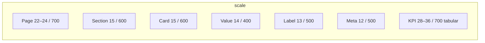

# 03 — Typography

**Documentation only.** Match the live app stack; do not switch to Inter.

---

## Font choice (current = permanent)

| Role | Family | Source |
|------|--------|--------|
| UI / body | **Geist Sans** | `next/font/google` → `--font-geist-sans` (`app/layout.tsx`) |
| Mono / IDs / code | **Geist Mono** | `--font-geist-mono` |
| Fallback | `system-ui, sans-serif` | `globals.css` body |

Geist is distinctive, modern, and enterprise-appropriate (Vercel lineage) without the Inter/Roboto default look. **Keep Geist** as the Transpo.ai typeface.

Body: `font-family: var(--font-geist-sans), system-ui, sans-serif` + `antialiased`.

---

## Type roles (CSS classes)

Defined in `globals.css`:

| Role | Class | Size | Weight | Tracking | Color |
|------|-------|------|--------|----------|-------|
| Page title | `.transpo-page-title` | 22px (`--text-page-title`); PageShell may use 24px ≥sm | 700 | -0.03em | `--foreground` |
| Section title | `.transpo-section-title` | 15px | 600 | -0.01em | `--foreground` |
| Card title | `.transpo-card-title` | 15px | 600 | — | `--foreground` |
| Label | `.transpo-label` | 13px | 500 | — | `--muted` |
| Value / body | `.transpo-value` | 14px | 400 | — | `--foreground` |
| Meta / caption | `.transpo-meta` | 12px | 500 | — | `--muted` |
| Emphasized number | `.transpo-number` | inherits | 700 | tabular-nums | inherits |

Legacy aliases: `.carrieros-*` — same rules; prefer `transpo-*` going forward.

---

## Scale (target hierarchy)

| Use | Size | Weight | Line height | Notes |
|-----|------|--------|-------------|-------|
| Page title | 22–24px | 700 | 1.25 | One per page |
| Dashboard KPI | 28–36px | 700 | 1.1 | Tabular nums; semantic color if status |
| Section | 15px | 600 | 1.35 | |
| Card title | 15px | 600 | 1.35 | |
| Body / table cell | 14px | 400 | 1.5 | Default reading size |
| Label | 13px | 500 | 1.4 | Form labels, field captions |
| Button | 14px | 600 | 1 | Matches `--text-value` |
| Caption / eyebrow | 12px | 500–600 | 1.4 | Eyebrow may use uppercase + wide tracking (PageShell) |
| Dense table meta | 12px | 500 | 1.35 | Secondary only |
| Mono ID | 12–13px | 500 | 1.4 | Geist Mono for load IDs, VINs when scanning |

**No tiny text** as primary content. Avoid &lt;12px except badges/counters with clear affordance.

---

## Numbers & stats

- Use `font-variant-numeric: tabular-nums` (`.transpo-number`) for KPIs, money, counts, HOS.
- Money: consistent currency formatting; bold for primary totals.
- Trends: pair number with short label (“vs last week”), not color alone.

---

## Do / Don’t

| Do | Don’t |
|----|--------|
| One clear page title | Multiple competing H1-sized headlines |
| Truncate with tooltip for long names | Wrap endlessly in dense rows |
| Plain language | Acronyms without expansion on first view |
| Comfortable 14px body | 11px “enterprise density” as default |
