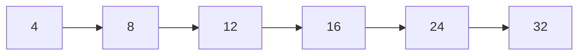

# 04 — Spacing System

**Documentation only.** Formalizes the scale already in `globals.css` and `TRANSPO_SPACING`.

---

## Scale (only these steps)

| Token | px | CSS | TS (`TRANSPO_SPACING`) | Typical use |
|-------|-----|-----|-------------------------|-------------|
| 1 | 4 | `--space-1` | `1` | Icon gaps, tight inline |
| 2 | 8 | `--space-2` | `2` | Button icon gap, chip padding-y |
| 3 | 12 | `--space-3` | `3` | Compact card padding, list gaps |
| 4 | 16 | `--space-4` | `4` | Default card/section gap, control px |
| 5 | 24 | `--space-5` | `5` | Section separation, page padding step |
| 6 | 32 | `--space-6` | `6` | Major section breaks |

**Do not** invent 6px, 10px, 14px, 20px, or 40px as system steps. Prefer the nearest token. Tailwind `p-4` / `gap-3` etc. should map to this scale in practice.

---

## Padding

| Context | Recommended |
|---------|-------------|
| PageShell mobile | 16 (`p-4`) |
| PageShell sm+ | 20–24 (`sm:p-5` / `lg:p-6`) — align toward tokens over time |
| Card content | 16–24 |
| Nested panel | 12–16 |
| Button horizontal | 16 |
| Input horizontal | 12–16 |
| Empty state | 24–32 vertical, 24 horizontal |
| Dialog content | 24 |

---

## Margins & gaps

| Context | Gap |
|---------|-----|
| Title → description | 4–8 |
| Header → working area | 16 |
| Card grid | 16 |
| Form fields stacked | 16 |
| Form label → control | 8 |
| Section blocks | 24–32 |
| KPI row | 16 |

---

## Grid & containers

| Token | Value | Notes |
|-------|-------|-------|
| Content max width | ~1560px | PageShell `max-w-[1560px]` |
| Ops content | Fluid within shell | Sidebar + main |
| Card grid | `1 / 2 / 3 / 4` cols | Break by viewport ([10-responsive.md](./10-responsive.md)) |
| Equal height cards | CSS grid + `h-full` | Dashboard rows |

Prefer CSS Grid / Flex with token gaps. Avoid dense 12-column TMS layouts unless a form truly needs it.

---

## Cards & sections

- Cards: surface + radius-lg + subtle inset border; padding from scale.
- Sections: section title, then 16 gap to content; 24–32 before next section.
- Lists: 8–12 between rows; 16 for comfortable scannable rows.

---

## Responsive spacing

| Viewport | Page padding | Card padding | Nav |
|----------|--------------|--------------|-----|
| Desktop ≥1280 | 24–32 | 16–24 | Side nav |
| Laptop ≥1024 | 16–24 | 16 | Side nav collapsible |
| Tablet ≥768 | 16 | 16 | Collapsed / drawer |
| Mobile &lt;768 | 16 | 12–16 | Bottom nav (Driver) |

Driver App uses mirrored `--dm-space-*` tokens (same 4–32 scale).
