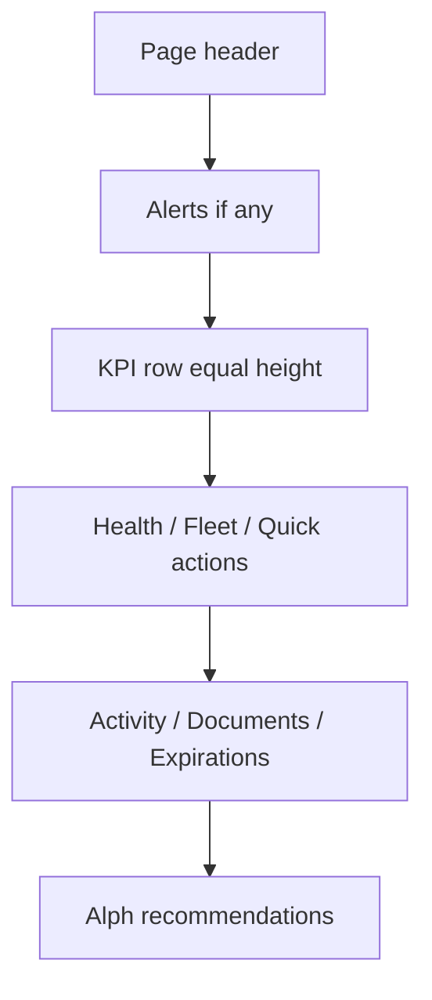

# 07 — Dashboard Patterns

**Documentation only.** Patterns for ops home, executive, fleet, and module overviews.

---

## Goals

- Answer the screen test in two seconds ([01-principles.md](./01-principles.md)).
- Calm density: informative without TMS clutter.
- Equal card heights in a row; clear section hierarchy.

---

## Section hierarchy

1. **Header** — PageShell title, one-line description, optional primary action
2. **Attention strip** (if needed) — critical/warning alerts only
3. **KPI row** — 3–5 large metrics
4. **Primary modules** — Business Health, Fleet Status, etc.
5. **Activity & lists** — Recent activity, documents, expirations
6. **AI recommendations** — Alph suggestions with confidence (never auto-execute critical)

---

## Large KPIs

| Spec | Value |
|------|-------|
| Number | 28–36px, Bold, tabular |
| Label | 13px Medium muted |
| Delta | 12–13px with semantic color + text (“↑ 4%”) |
| Card | `.transpo-card`, padding 16–24, equal height |

**Do:** 3–5 KPIs. **Don’t:** 12 tiny sparkline tiles fighting for attention.

---

## Business Health Score

- Large score number + short plain-language status (“Healthy”, “Needs attention”).
- Breakdown as compact rows (compliance, cash, utilization) — not a rainbow gauge alone.
- Link to what drives the score; never hide uncertainty in the model.

---

## Fleet Status

- Summary counts by state (available, on load, shop, OOS) with semantic pills.
- Optional strip component pattern (`FleetOverviewStrip` + `TRANSPO_COLORS`).
- Click-through to filtered fleet list.

---

## Recent Activity

- Scannable rows: actor · action · entity · time (meta 12px).
- Max ~5–8 on dashboard; “View all” for the rest.
- No zebra; subtle separators or spacing only.

---

## Alerts

- Only actionable or time-sensitive items on the dashboard.
- Group by severity; critical first.
- Each alert: what · impact · one action.

---

## AI Recommendations

- Card titled clearly as Alph suggestions.
- Each item: recommendation · confidence · why · **Confirm / Dismiss**.
- Follow [14-ai-surfaces.md](./14-ai-surfaces.md).

---

## Quick Actions

- 3–6 actions max (Assign, New load, Upload doc, etc.).
- Icon + label; one click → modal or route.
- Disable + tooltip when unavailable.

---

## Recent Documents

- File name · type · related load/driver · status pill · time.
- Upload CTA in empty state.

---

## Upcoming Expirations

- Sorted by soonest; warning/critical by window.
- Entity · document type · date · renew action.
- Never color-only — include “Expires in X days”.

---

## Layout density

| Zone | Density |
|------|---------|
| KPI / health | Airy — 16–24 padding |
| Lists | Medium — 12–16 row padding |
| Secondary widgets | Progressive disclosure |

**Equal heights:** use CSS grid on the row; stretch cards with `h-full`.
**Responsive:** KPI 4→2→1 columns; stack modules on tablet/mobile ([10-responsive.md](./10-responsive.md)).
